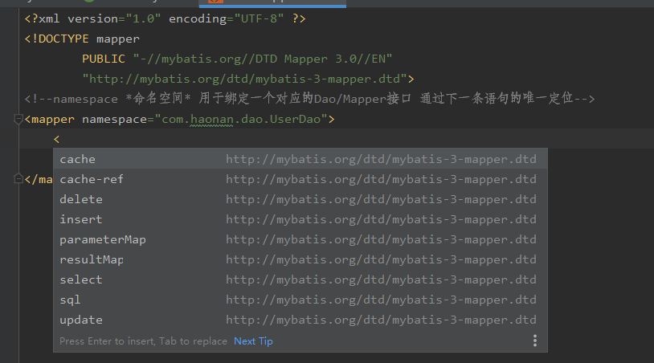
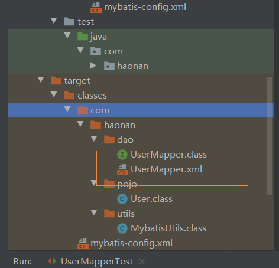
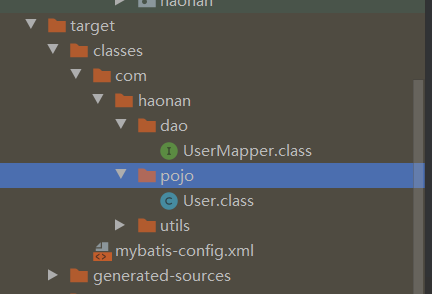

[TOC]

### 一、简介

[中文文档](http://mybatis.org/mybatis-3/index.html)

> 传统上Java与MySql的连接是用JDBC协议的。
> 它的弊端：①性能太低 ②sql有关代码写在了Java中，万一java文件中的sql语句需要修改就得重新打包编译。
> 解决方法：**Mybatis框架**。

ORM框架：Object Relational Mapping 对象关系映射  用于实现面向编程语言里不同类型系统的数据之间的转换。

**环境：**

- JDK1.8
- Mysql5.7
- maven 3.6.1
- IDEA

**在此之前需要掌握：**

- JDBC
- Mysql
- Java基础
- Maven（看Maven学习教程去吧、六个小时）
- Junit

#### 1.1什么是Mybatis

[百度百科](https://baike.baidu.com/item/MyBatis/2824918?fr=aladdin)

> MyBatis 本是[apache](https://baike.baidu.com/item/apache/6265)的一个**开源**项目[iBatis](https://baike.baidu.com/item/iBatis), 2010年这个项目由apache software foundation 迁移到了google code，并且改名为MyBatis 。2013年11月迁移到Github。
>
> **MyBatis 免除了几乎所有的 JDBC 代码以及设置参数和获取结果集的工作。**
>
> [中文文档](https://mybatis.org/mybatis-3/zh/getting-started.html)

MyBatis是一个Maven项目。

[到这里找它所需要的jar包](https://mvnrepository.com/search?q=mybatis)

- Maven仓库（后面的创建模块会用到）

```xml
<!-- https://mvnrepository.com/artifact/org.mybatis/mybatis -->
<dependency>
    <groupId>org.mybatis</groupId>
    <artifactId>mybatis</artifactId>
    <version>3.5.4</version>
</dependency>
```


- MyBatis 是一款优秀的**持久层框架**，它支持自定义 SQL、存储过程以及高级映射。

- MyBatis 避免了几乎所有的 JDBC 代码以及设置参数和获取结果集的工作。
- MyBatis 可以通过简单的 XML 或注解来配置和映射原始类型、接口和 Java POJO（Plain Old Java Objects，普通老式 Java 对象）为数据库中的记录。

#### 1.2持久化

**数据持久化**

 - 就是将程序的数据在持久状态和瞬时状态转化的过程。

 - 内存：断电即失——瞬时
 - 数据库(JDBC)，io文件——持久

**为什么需要持久化**

 - 有一些对象，不能让他丢掉
 - 内存太贵了，还容易丢失。

#### 1.3持久层

 - 层界限十分明显
 - 完成持久化工作的代码块

#### 1.4为什么需要Mybatis

- 方便
- 帮助程序员将数据存入到数据库中。
- 传统的JDBC代码太复杂了。简化，框架。

- 优点

  > 简单易学
  >
  > sql写在xml中，便于统一管理和优化
  >
  > 接触sql与程序代码的耦合
  >
  > sql和代码的分离
  >
  > 提供xml标签，支持编写动态sql
  >
  > **用的人也多**

  

### 二、第一个Mybatis程序


思路：搭建环境-->导入Mybatis-->编写代码-->测试！

> 这句话是回过头来说的：整个过程是把父工程的xml弄好，然后新建子模块，再设置子模块的mybatis-config.xml的环境，利用SqlSessionFactory类读取前面这个配置文件，生成一个对象，这个对象就是可以用来做配置xml文件中环境所作的的事情。

#### 2.1搭建环境

**搭建数据库**

```sql
CREATE DATABASE `mybatis`;
USE `mybatis`;
CREATE TABLE `user`(
	`id` INT(20) NOT NULL PRIMARY KEY,
	`name` VARCHAR(30) DEFAULT NULL,
	`pwd` VARCHAR(30) DEFAULT NULL
)ENGINE=INNODB DEFAULT CHARSET=utf8;
INSERT INTO `user`(`id`,`name`,`pwd`) VALUES
(1,'赵浩男','123456'),
(2,'麻新钰','123456'),
(3,'爱谁谁','123456')
```

**新建项目**

1.新建一个普通（不要骨架）的Maven项目
2.删除src目录，把他当作一个父工程，后面会在他下面新建子项目，这么做的**目的是直接控制全局的jar包依赖，不用在子模块中捣鼓**
3.在pom.xml中添加Maven依赖——去哪找这个依赖呢？[当然是Maven仓库中的mybatis了](https://mvnrepository.com/artifact/org.mybatis/mybatis)

```xml
<?xml version="1.0" encoding="UTF-8"?>
<project xmlns="http://maven.apache.org/POM/4.0.0"
         xmlns:xsi="http://www.w3.org/2001/XMLSchema-instance"
         xsi:schemaLocation="http://maven.apache.org/POM/4.0.0 http://maven.apache.org/xsd/maven-4.0.0.xsd">
    <modelVersion>4.0.0</modelVersion>
    <!--父工程描述-->
    <groupId>com.haonan</groupId>
    <artifactId>mybatisLearning</artifactId>
    <version>1.0-SNAPSHOT</version>
    <!--该目录下的子模块 下一步建立子模块后才会有下面这个标签对-->
    <modules>
        <module>mybatis01</module>
    </modules>
    <dependencies>
        <!--mysql驱动-->
        <dependency>
            <groupId>mysql</groupId>
            <artifactId>mysql-connector-java</artifactId>
            <version>5.1.4</version>
        </dependency>
        <!--mybatis依赖-->
        <dependency>
            <groupId>org.mybatis</groupId>
            <artifactId>mybatis</artifactId>
            <version>3.5.2</version>
        </dependency>
        <!--junit依赖-->
        <dependency>
            <groupId>junit</groupId>
            <artifactId>junit</artifactId>
            <version>4.12</version>
            <scope>test</scope>
        </dependency>
    </dependencies>

</project>
```

Enable import后Maven就能自动导入了。

#### 2.2创建一个模块

##### 2.2.1创建一个子module-Maven

> 项目上new一个module 选择Maven项目，这就是一个子模块了，命名为mybatis01。

这样做的优点是，我们之前在父工程那里已经修改了pom.xml配置文件了，不需要在子项目中再去重新导入依赖包了。使得jar包依赖可以统一管理。

```xml
<modules>
   <module>mybatis01</module>
</modules>
```

创建完成后，父工程中的pom.xml文件出现上面的modules标签。

子模块中的pom.xml中也会出现父工程的信息。

```xml
<parent>
    <artifactId>mybatisLearning</artifactId>
    <groupId>com.haonan</groupId>
    <version>1.0-SNAPSHOT</version>
</parent>
```

##### 2.2.2新建mybatis-config.xml

- **编写mybatis的核心配置的文件——从 XML 中构建 SqlSessionFactory**
- **mybatis工具类**

[看文档中对这部分的描述](https://mybatis.org/mybatis-3/zh/getting-started.html)

每个基于 MyBatis 的应用都是以一个 SqlSessionFactory 的实例为核心的。SqlSessionFactory 的实例可以通过 SqlSessionFactoryBuilder 获得。而 SqlSessionFactoryBuilder 则可以**从 XML 配置文件或一个预先配置的 Configuration 实例来构建出 SqlSessionFactory 实例**。

从 XML 文件中构建 SqlSessionFactory 的实例非常简单，建议使用类路径下的资源文件进行配置。 但也**可以使用任意的输入流（InputStream）实例**，比如用文件路径字符串或 file:// URL 构造的输入流。**MyBatis 包含一个名叫 Resources 的工具类**，它包含一些实用方法，使得从类路径或其它位置加载资源文件更加容易。（具体讲解在2.2.5中）

```java
String resource = "org/mybatis/example/mybatis-config.xml";
InputStream inputStream = Resources.getResourceAsStream(resource);
SqlSessionFactory sqlSessionFactory = new SqlSessionFactoryBuilder().build(inputStream);
```

**XML 配置文件中**包含了对 **MyBatis 系统的核心设置**，包括获取数据库连接实例的数据源（DataSource）以及决定事务作用域和控制方式的事务管理器（TransactionManager）。

> 将官网中的代码复制下来,这就相当于是个模板啊。以后还得接着用呢
>
> ```xml
> <?xml version="1.0" encoding="UTF-8" ?>
> <!DOCTYPE configuration
>   PUBLIC "-//mybatis.org//DTD Config 3.0//EN"
>   "http://mybatis.org/dtd/mybatis-3-config.dtd">
> <configuration>
>   <environments default="development">
>     <environment id="development">
>       <transactionManager type="JDBC"/>
>       <dataSource type="POOLED">
>         <property name="driver" value="${driver}"/>
>         <property name="url" value="${url}"/>
>         <property name="username" value="${username}"/>
>         <property name="password" value="${password}"/>
>       </dataSource>
>     </environment>
>   </environments>
>   <mappers>
>     <mapper resource="org/mybatis/example/BlogMapper.xml"/>
>   </mappers>
> </configuration>
> ```

复制到resource下新建的**mybatis-config.xml** 一般默认就写这个，不写这个的话到时候就把

```java
String resource = "org/mybatis/example/mybatis-config.xml";
```

中对应的字段改掉。

现在我们在resource中新建一个文件**mybatis-config.xml** 复制上面的内容到里面，略加修改。

> 先把mappers标签对删掉（对应上面的截图看）
> 数据库部分信息等链接上数据库（见2.2.3），复制url等然后去修改

```xml
<?xml version="1.0" encoding="UTF-8" ?>
<!DOCTYPE configuration
        PUBLIC "-//mybatis.org//DTD Config 3.0//EN"
        "http://mybatis.org/dtd/mybatis-3-config.dtd">
<!--configuration核心配置文件-->
<configuration>
    <!--环境-->
    <environments default="development">
        <environment id="development">
            <!--事务管理默认是使用JDBC的传输方式-->
            <transactionManager type="JDBC"/>
            <dataSource type="POOLED">
                <!--数据库相关的信息-->
                <property name="driver" value="com.mysql.jdbc.Driver"/>
                <property name="url" value="jdbc:mysql://localhost:3306/mybatis?useSSL=true&amp;
                userUnicode=true&amp;characterEncodeing=UTF-8"/>
                <!--useSSL 设置安全连接 在xml中&这个符号需要转义 后面加上amp才是真的&符号
                后面两个参数是为了输入中文不乱码用的-->
                <property name="username" value="root"/>
                <property name="password" value="XXX!"/>密码保密
            </dataSource>
        </environment>
    </environments>
</configuration>
```

然后跳过2.2.3继续配置

注：也可以不用XML构建SqlSessionFactory，这里就不展示了，具体的见[官方说明文档](https://mybatis.org/mybatis-3/zh/getting-started.html)

##### 2.2.3利用IDEA连接数据库

先**连接上数据库**吧，这样填写上面这个xml文件中数据库的url也方便。但是出现问题了，我花了一晚上去解决啊。

>  1.要用企业版的IDEA才能使用database功能
> 2.第一次连接数据库会没有驱动文件，得下载，但是下载得时候动不动就崩溃了。
> 原因：这个下载其实就是用工程用的Maven仓库中得jar文件，没有就去中央仓库找，为什么失败，因为我没有检查好Maven配置，用的还是默认的.m2下的setting.xml，换成我自己设置的目录下的setting'.xml文件后就好了，启用阿里云仓库下载飞快。
> 

下载了最新版的jdbc终于捣鼓好了，耗时一小时，然后有报错：Server returns invalid timezone. Go to 'Advanced' tab and set 'serverTimezon 网上说是时区错误，MySQL默认的时区是UTC时区，比北京时间晚`8`个小时。

- 所以要修改mysql的时长在mysql的命令模式下，输入：set global time_zone='+8:00';就好了
- 或者：在默认的安装路径下`C:----MySQLServer下`找到`my.ini`文件。修改在`[mysqld]`下方添加：**default-time-zone='+08:00'**。`（注意引号）`
- 我根据提示信息，在advance下找到了这个servertime原来是空着的，不过加上了UTC(网上一个教程的灵感，这是世界统一时间)

**终于成功了！！！！！！！！！！！！！！！！！！！！！！**

##### 2.2.4从SQLSessionFactory中获取SqlSession

> 续：mybatis-congig.xml已经完成，已经构建好SqlSessionFactory，接下来就是从其中获取SqlSession。
> 官方文档：既然有了 SqlSessionFactory，顾名思义，我们可以从中获得 SqlSession 的实例。SqlSession 提供了在数据库执行 SQL 命令所需的所有方法。你可以通过 SqlSession 实例来直接执行已映射的 SQL 语句。例如：
>
> ```java
> try (SqlSession session = sqlSessionFactory.openSession()) {
>   Blog blog = (Blog) session.selectOne("org.mybatis.example.BlogMapper.selectBlog", 101);
> }
> ```
>
> 诚然，这种方式能够正常工作，对使用旧版本 MyBatis 的用户来说也比较熟悉。但现在有了一种更简洁的方式——**使用和指定语句的参数和返回值相匹配的接口**（比如 BlogMapper.class），现在你的代码不仅更清晰，更加类型安全，还不用担心可能出错的字符串字面值以及强制类型转换。例如：
>
> ```java
> try (SqlSession session = sqlSessionFactory.openSession()) {
>   BlogMapper mapper = session.getMapper(BlogMapper.class);
>   Blog blog = mapper.selectBlog(101);
> }
> ```
>
> 这个代码是什么意思呢？稍后我们再讲。

##### 2.2.5编写mybatis工具类

> 用于创建sqlSession对象并返回，MybatisUtils.getSqlSession()

首先先看之前我们讲mybatis-config.xml时说的那三行代码：

```java
String resource = "org/mybatis/example/mybatis-config.xml";
InputStream inputStream = Resources.getResourceAsStream(resource);
SqlSessionFactory sqlSessionFactory = new SqlSessionFactoryBuilder().build(inputStream);
```

> 通过resource读取配置文件形成一个流，然后通过SqlSessionFactoryBuilder().build(inputStream)去加载构建这个工厂。
> 但是每次读取这个流进行构建sqlsession对象会很麻烦，所以我们就要去构建一个工具类。

1. 建包 java中建立com.haonan.dao com.haonan.utils 在其中utils时工具包
2. 再utils下建工具类MybatisUtils
   

其中写入代码如下（这时候就要用到上面的三行代码了）：最后生成一个sqlSessionFactory对象。

```java
package com.haonan.utils;
import org.apache.ibatis.io.Resources;
import org.apache.ibatis.session.SqlSession;
import org.apache.ibatis.session.SqlSessionFactory;
import org.apache.ibatis.session.SqlSessionFactoryBuilder;
import java.io.IOException;
import java.io.InputStream;
//sqlSessionFactory --> sqlSession
public class MybatisUtils {
    //接下来让他加载当前子模块下的mybatis-config文件,创建sqlSessionFactory使其生成sqlSession
    private static SqlSessionFactory sqlSessionFactory;
    static{
        //使用mybatis(提供SqlSessionFactory、SqlSessionFactoryBuilder类)获取sqlSession对象
        try {//根据Idea的提示这三句话不能直接写，得加try catch
            String resource="mybatis-config.xml";
            InputStream inputStream = Resources.getResourceAsStream(resource);
           	sqlSessionFactory = new SqlSessionFactoryBuilder().build(inputStream);
        } catch (IOException e) {
            e.printStackTrace();
        }
    }
    public static SqlSession getSqlSession(){//通过前面的sqlSessionFactory工厂生成sqlSession
        //SqlSession sqlSession=sqlSessionFactory.openSession();
        //return sqlSession;返回这个sqlSession对象
        return sqlSessionFactory.openSession();
    }
}
```

现在这个session就像是jdbc里面的statement对象一样,复习一下下面的代码。

```java
Class.forName("oracle.jdbc.driver.OracleDriver");
String static final DBURL="jdbc:oracle:thin:@localhost:1521:orcl";
String static final DBUSER="user";
String static final DBPASS="password";
Connection conn=null;
conn=DriverManager.getConnection(DBURL,DBUSER,DBPASS);
//数据库链接完成。
//Statement接口需要通过Connection接口进行实例化操作。
Statement stmt;
stmt=conn.createStatement();
```

现在一个连接了mybatis-config.xml中定义的数据库的对象sqlSession（当然那个xml中可以设置不止是数据库一个环境，这里是只有数据库的environment而已）已经可以通过工具类MybatisUtils调用它的static方法getSqlSession获得了。
下面就可以写代码了，来使用sqlSession。

#### 2.3编写代码（在mybatis01那一层哈）

##### 2.3.1实体类 建立User 看下面的包就知道是什么路径下建立的了

```java
package com.haonan.pojo;

public class User {
    //根据mybatis-config.xml中连接数据库的内容把实体类建立好
    //名字和数据库内容要一样
    private int id;
    private String name;
    private String pwd;

    public User() {
    }

    public User(int id, String name, String pwd) {
        this.id = id;
        this.name = name;
        this.pwd = pwd;
    }

    public int getId() {
        return id;
    }

    public void setId(int id) {
        this.id = id;
    }

    public String getName() {
        return name;
    }

    public void setName(String name) {
        this.name = name;
    }

    public String getPwd() {
        return pwd;
    }

    public void setPwd(String pwd) {
        this.pwd = pwd;
    }

    @Override
    public String toString() {
        //这就是为什么要名字一样的原因，快捷键alt+ins快速生成这些方法时下面这些变量就不用改了
        return "User{" +
                "id=" + id +
                ", name='" + name + '\'' +
                ", pwd='" + pwd + '\'' +
                '}';
    }
}

```

##### 2.3.2Dao接口（其实就是官方说的Mapper） 在dao下建立接口和UserMapper.xml配置文件

```java
package com.haonan.dao;
import com.haonan.pojo.User;
import java.util.List;
public interface UserDao {
    List<User> getUserList();//获得User
}
```

##### 2.3.3接口实现类  这个配置文件的作用就是相当于不用mybatis时，要用到的UserDaoImpl接口实现类一样。

看文档研究如何写UserMapper.xml

> 现在你可能很想知道 SqlSession 和 Mapper 到底具体执行了些什么操作，但 SQL 语句映射是个相当广泛的话题，可能会占去文档的大部分篇幅。 但为了让你能够了解个大概，这里会给出几个例子。
>
> 在上面提到的例子中，**一个语句既可以通过 XML 定义，也可以通过注解定义**。我们先看看 XML 定义语句的方式，事实上 MyBatis 提供的所有特性都可以利用基于 XML 的映射语言来实现，这使得 MyBatis 在过去的数年间得以流行。如果你用过旧版本的 MyBatis，你应该对这个概念比较熟悉。 但相比于之前的版本，新版本改进了许多 XML 的配置，后面我们会提到这些改进。这里给出一个基于 XML 映射语句的示例，它应该可以**满足上个示例中 SqlSession 的调用**。

先不写用注解实现，先学习用xml文件定义,将下面的官方代码复制到UserMapper.xml中。

> ```xml
> <?xml version="1.0" encoding="UTF-8" ?>
> <!DOCTYPE mapper
>   PUBLIC "-//mybatis.org//DTD Mapper 3.0//EN"
>   "http://mybatis.org/dtd/mybatis-3-mapper.dtd">
> <mapper namespace="org.mybatis.example.BlogMapper">
>   <select id="selectBlog" resultType="Blog">
>     select * from Blog where id = #{id}
>   </select>
> </mapper>
> ```

修改namespace,然后在其中定义需要的操作。



```xml
<?xml version="1.0" encoding="UTF-8" ?>
<!DOCTYPE mapper
        PUBLIC "-//mybatis.org//DTD Mapper 3.0//EN"
        "http://mybatis.org/dtd/mybatis-3-mapper.dtd">
<!--namespace *命名空间* 用于绑定一个对应的Dao(Mapper接口) 通过下一条语句的唯一定位-->
<mapper namespace="com.haonan.dao.UserDao"><!--后面会把他改成UserMapper-->
    <!--插入一个查询语句-->
    <select id="getUserList" resultType="com.haonan.pojo.User">
        /*返回一个UserList 类型是User类*/
        select * from mybatis.user
    </select>
</mapper>
```

注：namespace不要写错，返回类型不要写错，名字不要写错

#### 2.4测试代码

- junit测试

> 在test包下建立对应main中的层级结构com.haonan.dao.UserDaoTest

```java

public class UserMapperTest {
    @Test
    public void test(){
        //要去获取sqlSession，这样才能进行数据库操作
        SqlSession sqlSession = MybatisUtils.getSqlSession();
        //有两种方式执行，一种是获取Mapper 记住UserDao就相当于UserMapper 翻译过来就是用户映射
        sqlSession.getMapper(UserMapper.class);
    }
}
```

在sqlSession调用getMapper来获得UserDao接口的时越来越感觉有点不舒服：在老师用的这个例子中，把UserMapper写成了UserDao，本来是为了方便理解衔接上他以前讲的JavaWeb的知识但是我又没有上过他之前的课，并且越往后越发现这种命名并不好，所以我又都改回来了，神奇的是我把dao下面的UserDao接口一改，对应的UserDaoTest的名字和绑定UserDao的UserMapper.xml中的namespace也自动都改了，很方便啊Idea太强了（不是rename而是refactor）！

这时候再来理解getMapper就简单了，最起码从语言的定义上有了亲近感。

怎么获取的Mapper呢？就是通过UserMapper这个接口的class对象。

```java
UserMapper userMapper = sqlSession.getMapper(UserMapper.class);
List<User> userList = userMapper.getUserList();
```

我们获取这个Mapper就是为了是使用这个接口类中的方法。可是我们回过头来想就算获取了这个UserMapper又能干啥，UserMapper的代码很简单啊。

```java
package com.haonan.dao;
import com.haonan.pojo.User;
import java.util.List;
public interface UserMapper {
    List<User> getUserList();
}
```

**对的，所以这里就体现出了为啥UserMapper.xml叫做UserMapper接口的实现类的概念。**因为我们正是在UserMapper.xml中实现了一些功能啊。

```xml
<?xml version="1.0" encoding="UTF-8" ?>
<!DOCTYPE mapper
        PUBLIC "-//mybatis.org//DTD Mapper 3.0//EN"
        "http://mybatis.org/dtd/mybatis-3-mapper.dtd">
<mapper namespace="com.haonan.dao.UserMapper">
    <!--插入一个查询语句-->
    <select id="getUserList" resultType="com.haonan.pojo.User">
        <!-- 具体解释看第三节 -->
        /*返回一个UserList 类型是User类*/
        select * from mybatis.user
    </select>
</mapper>
```

那个叫getUserList的id就是对应接口里的getUserList方法啊。这其实就是相当于用xml重写了接口的方法嘛。

所以说获得的这个userMapper中的方法其实并没有那么简单。下面是完整的测试代码只是第一种方式，通过获取Mapper的方式实现的。

```java
package com.haonan.dao;
import com.haonan.pojo.User;
import com.haonan.utils.MybatisUtils;
import org.apache.ibatis.session.SqlSession;
import org.junit.Test;
import java.util.List;
public class UserMapperTest {
    @Test
    public void test(){
        SqlSession sqlSession = MybatisUtils.getSqlSession();
        //Mapper 记住UserDao就相当于UserMapper 翻译过来就是用户映射
        UserMapper userMapper = sqlSession.getMapper(UserMapper.class);
        List<User> userList = userMapper.getUserList();
        for (User user : userList) {
            System.out.println(user.toString());
        }
        sqlSession.close();
    }
}
```

#### 2.5几个错误分析：

1. ****java.lang.NullPointerException**
   	**at com.haonan.utils.MybatisUtils.getSqlSession(MybatisUtils.java:25)**
      	at com.haonan.dao.UserMapperTest.test(UserMapperTest.java:14)**

下面是几种原因

> 1、字符串变量未初始化
> 2、接口类型的对象没有用具体的类初始化，比如：
> Map map // 会报错
> Map map = new Map(); //则不会报错了
> 3、当一个对象的值为空时，你没有判断为空的情况。
> 4、字符串与文字的比较，文字可以是一个字符串或Enum的元素，如下会出现异常
> String str = null;
> if（str.equals（“Test”））{
> //这里的代码将不会被触发，因为会抛出java.lang.NullPointerException异常。
> }
> 5、优先使用String.valueOf（）方法代替toString（）
> 当程序代码需要对象的字符串表示形式时，请避免使用该对象的toString方法。如果你的对象的引用等于null，NullPointerException则会抛出，使用静态String.valueOf方法，该方法不会抛出任何异常并打印"null"
> 6、class被声明了类型， 默认 class = null; 这样在调用class中方法的时候系统只能给你个空指针异常， 给其实例化就好了：class = new Class();
> 7、返回null，方法的返回值不要定义成为一般的类型，而是用数组。这样如果想要返回null的时候就能避免许多不必要的NullPointerException

看样子是返回了一个NULL了。

```java
private static SqlSessionFactory sqlSessionFactory;
    static{
            SqlSessionFactory sqlSessionFactory = new SqlSessionFactoryBuilder().build(inputStream);
    public static SqlSession getSqlSession(){
        return sqlSessionFactory.openSession();
    }
//这就是出错代码的地方2.2.4中的代码精简了一下，发现问题了，当时第三行重新SqlSessionFactory 了一个对象。作用域导致返回null。是自己失误了，2.2.4中已经把代码改回来了。
```

**2.org.apache.ibatis.binding.BindingException: Type interface com.haonan.dao.UserMapper is not known to the MapperRegistry.**

报错位置是：test测试类

```java
UserMapper userMapper = sqlSession.getMapper(UserMapper.class);
```

UserMapper说是没注册MapperRegistry。为啥会这样呢？

##### 整个过程的梳理

我们来重新梳理一遍这个模块实现的整个过程，我们好像遗漏了什么。
	首先我们是将一个数据库连接封装到了一个mybatis-config.xml中，希望它产生一个类似于jdbc中一个statement的东西——sqlSession，为了产生它我们将用于生成SqlSession的一些语句放在了一个类中写成工具类中方便以后使用。
	之后我们又开始着手开发实现类的编写。
	我们写了User实体类对应数据库中的内容并在里面写了构造方法和toString打印方法。再然后写了一个UserMapper接口希望它承接一些数据库的操作，但是这些操作并不是写在接口里而是放在它的实现类中，随即我们写了UserMapper.xml通过namespace绑定在UserMapper接口上作为它的实现类来实现它返回一个UserList的功能。
然后我们开始写测试类，我们想要先获得一个SqlSession对象，来完成数据库的一些操作，而这些操作正好放在UserMapper.xml中。这时候停下来想想，在此之前用于产生SQLSession的mybatis-config.xml和Mybatis工具类并没有与UserMapper接口和UserMapper有什么交集。他们俩是怎么建立联系的呢？就在下一步-->然后sqlSession实例很奇妙的用getMapper获得了这个操作。这时候又要想，咋你凭啥想要我的Mapper我就给你啊？之前咱俩不是没啥关系么？对！！！没有关系，所以在这行代码这里报错了。报错信息就是就是说this Mapper is not Registed in the sqlSession。
那我们就可以想如何把这个UserMapper和这个SqlSession联系起来呢？找他爹呀，就是mybatis-config.xml。具体怎么做呢？这就要回溯到我们建立mybatis-config.xml时的地方了。拿我们写的与官网的例子一比，发现这个文件中少了个mapper标签对。

```xml
<mappers>
    <mapper resource="org/mybatis/example/BlogMapper.xml"/>
  </mappers>
```

当时为啥不写？因为当时还没有这个UserMapper呢，谁也不能未卜先知不是所以当时老师不写。所以添加缺少的在这里为注册的Mapper就行。

```xml
<mappers>
        <mapper resource="com/haonan/dao/UserMapper.xml"/>
</mappers>
```


这正好也帮我们理解了原来getMapper是这个意思啊，获取已经注册的Mapper。

3.### Error querying database.  Cause: com.mysql.jdbc.exceptions.jdbc4.CommunicationsException: Communications link failure
连不上本地数据？？？
时区serverTimeZone没设置好。

```xml
<dataSource type="POOLED">
    <!--数据库相关的信息-->
    <property name="driver" value="com.mysql.jdbc.Driver"/><!--事务管理-->
    <property name="url" value="jdbc:mysql://localhost:3306/mybatis?
    serverTimeZone=Asia/Shanghai&amp;//把这个改了它。
    useSSL=true&amp;
    useUnicode=true&amp;
    characterEncoding=UTF-8"/>
    <!--useSSL 设置安全连接 在xml中&这个符号需要转义 后面加上amp才是真的&符号
    后面两个参数是为了输入中文不乱码用的-->
    <property name="username" value="root"/>
    <property name="password" value="Zhaohaonan1234!"/>
</dataSource>
```

4.当我想用maven的clean清楚target文件时，报了下面这个错：

Invalid packaging for parent POM com.haonan:mybatisLearning:1.0-SNAPSHOT (E:\IJ_work\mybatisLearning\pom.xml), must be "pom" but is "jar" @ com.haonan:mybatisLearning:1.0-SNAPSHOT, E:\IJ_work\mybatisLearning\pom.xml

没有有效的打包方式，在父工程下的pom中加入packaging标签，设置为pom。

```xml
<packaging>pom</packaging>
```

然后成功了。

5.还有可能出现的其他错误——资源过滤问题——找不到UserMapper.xml（虽然我没有遇见）
查看resource生成目录中有没有这个东西。弹幕里说是什么工程架构和部署架构不一致的问题，说啥只要放进resource里面就好了，我也没有放进resource中啊。


我的有这个文件，但是我在第四步clean了target以后，并且加上了那行代码以后再运行就特么崩了报错了？报的就是这个错，这也太神奇了吧！？并且target下的


UserMapper.xml没了

**maven由于他的约定大于配置，比如Java里面只能写Java，在它里面写xml是导不出的。**
现在在回过头来看弹幕说的那句话，把文件放进resource中就行了，但是我把UserMapper.xml放进那里面了也没有用。可能是过于粗暴不好使。
那就用老师教的方法吧。在pom.xml中加上build操作。并且建议大家，每新建一个maven项目，就把该设置导入pom.xml文件中，以防不测！！！

```xml
<!--在build中配置resource，来防止我们资源导出失败的的问题-->
<build>
    <resources>
        <resource>
            <directory>src/main/resources</directory>
            <includes>
                <include>**/*.properties</include>
                <include>**/*.xml</include>
            </includes>
            <filtering>true</filtering>
        </resource>
        <resource>
            <directory>src/main/java</directory>
            <includes>
                <!--让Java路径下可以包含下面这俩个文件-->
                <include>**/*.properties</include>
                <include>**/*.xml</include>
            </includes>
            <filtering>true</filtering>
        </resource>
    </resources>
</build>
```

不行啊  还是不好使，当是excludes的时候甚至它把java文件整成resource了，我又mark as成Java文档形式再把这几行代码删了以后才又好使了（并且删除了前面那行packaging pom 要不然运行不起来啊）先不管了  先学习第二种方法吧，等等，先贴一下第一种方法的完整代码，前面没有写

```java
package com.haonan.dao;

import com.haonan.pojo.User;
import com.haonan.utils.MybatisUtils;
import org.apache.ibatis.session.SqlSession;
import org.junit.Test;
import java.util.List;
public class UserMapperTest {
    @Test
    public void test(){
        //要去获取sqlSession，这样才能进行数据库操作
        SqlSession sqlSession = MybatisUtils.getSqlSession();
        //有两种方式执行，一种是获取Mapper 记住UserDao就相当于UserMapper 翻译过来就是用户映射
        UserMapper userMapper = sqlSession.getMapper(UserMapper.class);
        List<User> userList = userMapper.getUserList();
        for (User user : userList) {
            System.out.println(user.toString());
        }
        //关闭sqlSession
        sqlSession.close();//不关会浪费内存
    }
}
```


第二种方法不太常用,也不建议用。

三个接口的分析


所以修改test代码

```java
package com.haonan.dao;

import com.haonan.pojo.User;
import com.haonan.utils.MybatisUtils;
import org.apache.ibatis.session.SqlSession;
import org.junit.Test;

import java.util.List;

public class UserMapperTest {
    @Test
    public void test(){
        //要去获取sqlSession，这样才能进行数据库操作
        SqlSession sqlSession = MybatisUtils.getSqlSession();
        try {
            //有两种方式执行，一种是获取Mapper 记住UserDao就相当于UserMapper 翻译过来就是用户映射
            UserMapper userMapper = sqlSession.getMapper(UserMapper.class);
            List<User> userList = userMapper.getUserList();
            for (User user : userList) {
                System.out.println(user.toString());
            }
        } finally {
            //关闭sqlSession
            sqlSession.close();//不关会浪费内存
        }
    }
}
```

### 三、CRUD增删改查

#### 3.1select选择查询

```xml
<mapper namespace="com.haonan.dao.UserMapper">
    <!--插入一个查询语句-->
    <select id="getUserList" resultType="com.haonan.pojo.User">
        /*返回一个UserList 类型是User类*/
        select * from mybatis.user
    </select>
</mapper>
```

- id: 就是对应namespace中的方法名字
- resultType：Sql语句执行的返回值
- parameter：参数类型，有的时候不用写参数类型也行，但这个传入参数是自己定义的类那就要写了。
- 在这里sql语句后面加不加分号都行

现在我们去UserMapper接口中去新加一个方法。

```java
//根据ID查询用户
    User getUserById(int id);
```

并在UserMapper.xml中新建一个namespace来实现它

```xml
<!-- 实现方法getUserById根据Id查询 -->
<select id="getUserById" parameterType="int" resultType="com.haonan.pojp.User">
    select * from mybatis.user where id = #{id}
</select>
```

测试类新加对该功能的测试

```java
@Test
    public void getUserById(){
        SqlSession sqlSession = MybatisUtils.getSqlSession();
        try {
            UserMapper userMapper = sqlSession.getMapper(UserMapper.class);
            User uer = userMapper.getUserById(2);
            System.out.println(uer.toString());
            sqlSession.close();//不关会浪费内存
        } finally {
            sqlSession.close();
        }
    }
```

```sql
User{id=2, name='麻新钰', pwd='123456'}
```

成功打印。（千万不要把mapper里面的namespace，id，参数，和返回类型写错，一个字母错了，就不会运行通过。）

#### 3.2增加操作

UserMapper中

```java
//新增一个用户
int addUser(User user);
```

UserMapper.xml中

```xml
<!--实现新增用户addUser方法，这里返回值是一个int，因为我们也不需要这个返回值所以返回类型可以不写-->
<insert id="addUser" parameterType="com.haonan.pojo.User">
    insert into mybatis.user (id , name , pwd) values (#{id},#{name},#{pwd});
</insert>
```

虽然UserMapper的addUser方法中参数是User对象，但是可以在xml中传user信息参数

test中：

```java
@Test
public void addUser(){
    SqlSession sqlSession=MybatisUtils.getSqlSession();
    try {
        UserMapper mapper=sqlSession.getMapper(UserMapper.class);
        User user=new User(4,"第四个人","mima");
        mapper.addUser(user);
        System.out.println("新增用户为："+user.toString());
    }finally {
        sqlSession.close();
    }
}
```

**执行完上述代码后数据库中并没有提交新的第四条用户数据。**

为啥？

**因为增删改查操作需要提交事务**
弹幕说有的人成功了，是因为当与数据库引擎说好自动commit时，就不用提交事务了。

**提交事务：**

```java
finally {
    sqlSession.commit();
    sqlSession.close();
}
```

#### 3.3提交到数据库，出现乱码问题

4	????	mima

字符编码尽量要全部统一：

> ①IDE，项目编码设置为UTF-8，很多时候IDE默认为UTF－８
> ②数据库建表时设置为UTF-8，后期也可以改，比如通过SQLyog可视化界面
> ③JDBC连接时也要用UTF-8
> ④建表格时
>
> ```sql
> CREATE TABLE `user`(
> `id` INT(20) NOT NULL PRIMARY KEY,
> `name` VARCHAR(30) DEFAULT NULL,
> `pwd` VARCHAR(30) DEFAULT NULL
> )ENGINE=INNODB DEFAULT CHARSET=utf8;
> ```
>
> ⑤用use database_name;  show variables like "%chara%";查看你要用的database_name这个库的详细的字符集.
>
> 
>
> character_set_client为客户端编码方式；
> character_set_connection为建立连接使用的编码方式；
> character_set_database为数据库的编码方式；
> character_set_results是结果集的编码方式；
> character_set_server为数据库服务器的编码方式。
> [原文连接](https://blog.csdn.net/lsr40/article/details/78736855)
> 设置:
> 
> 用set character_set_server=utf8;这种方式逐一设置一下,那个filesystem不要动,可能时因为file文件都是靠字节输入输出的
>
> 
> 还不好使的话(因为设置了以后很有可能失效)就去去修改配置文件my.ini [连接](https://q.cnblogs.com/q/103634/)
>
> 
> 先在俩个位置添加代码试试.重启一些服务,还是不好.先拉到把.
>
> 
>
> 好了  问题还是在IDEA  没有设置UTF-8
> 
> 具体的看笔记吧.  [印象识堂](https://www.yinxiang.com/everhub/note/08e8fae2-76a6-47cd-870e-47729c3f4d10)

#### 3.4更新和删除

```java
	//更新用户
    int updateUser(User user);

    //根据Id删除用户
    int deleteUserById(int id);
```

UserMapper.java中定义

```xml
<!--实现更新操作-->
<update id="updateUser" parameterType="com.haonan.pojo.User">
    update mybatis.user set name=#{name},pwd=#{pwd} where id=#{id}
</update>

<!--实现删除操作-->
<delete id="deleteUserById" parameterType="int" >
    delete from mybatis.user where id=#{id}
</delete>
```

UserMapper.xml中实现

```java
@Test
public void updateUser(){
    SqlSession sqlSession=MybatisUtils.getSqlSession();
    try {
        UserMapper mapper=sqlSession.getMapper(UserMapper.class);
        mapper.updateUser(new User(4,"新名字","pssssqwe"));
    } finally {
        sqlSession.commit();
        sqlSession.close();
    }
}
@Test
public void deleteUser(){
    SqlSession sqlSession=MybatisUtils.getSqlSession();
    try {

        UserMapper mapper=sqlSession.getMapper(UserMapper.class);
        for (int i=5;i<=36;i++){
            mapper.deleteUserById(i);
        }

    } finally {
        sqlSession.commit();
        sqlSession.close();
    }
}
```

UserMapperTest.java中实现


成功。

#### 3.5常见错误

- 标签不要写错

- resource用路径的方式绑定mapper时，用com/haonan/...这种格式，不要用com.haonan....

- 程序配置文件必须符合规范

  

#### 3.6万能Mapper

假设我们的实体类，或者数据库中的表，字段或者参数过多，我们应当考虑使用Map！

```java
User addUser2(Map<String,Object>map);
```

```xml
<insert id="addUser2" parameterType="map">
       insert into mybatis.user(id,name,pwd)values (#{userid},#{username},#{userpwd})
 </insert>
```


```java
public void addUser2(){
        SqlSession sqlSession=MybatisUtils.getSqlSession();
        try{
            UserMapper mapper = sqlSession.getMapper(UserMapper.class);
            Map<String,Object> map=new HashMap<String, Object>();
            map.put("userid",5);
            map.put("userd","asdasd");
            mapper.addUser2(map);
        }finally {
            sqlSession.commit();
            sqlSession.close();
        }
    }
```

我在这里故意把第二句中的userpwd写错（xml中的密码引用字段是#{userpwd}）

```java
 map.put("userid",5);
 map.put("userd","asdasd");
```

这会产生什么结果呢？


插入了一个id为5的user，但密码是空，所以这里就很清晰了，因为我们要的关键字在xml中定死了，只能是userid、username、userpwd。所以我们明白这是一个什么样的插入过程了，之前我们用实体类作为addUser()的传入参数时，必须要把所有的信息都填上这也才能实例化出一个user，并且在xml的插入标签中#{}的字段必须对应User中的定义。

现在有了map，通过put把我们需要的信息添加就行，而不是全部添加进去。因为在map中遍历时只会想要的关键字——key对应的value。你随便填什么map.put("asdasda","asd");没用，对不上关键字。

当我改成

```java
map.put("userid",6);
map.put("userpwd","asd");
map.put("username","第六人");
mapper.addUser2(map);
```

时就好了，说明一下：同样，咱也不能重复插入数据库空已有的id号，也不能将这个id弄成空值。

再写一个吧。

```java
//万能Mapper返回User
User getUserById2(Map<String,Object> map);
```

```xml
<select id="getUserById2" parameterType="map" resultType="com.haonan.pojo.User">
    select * from mybatis.user where id=#{userid} and name=#{username}
</select>
```

这里传入是map，返回User对象。

```java
@Test
public void getUserById2(){
    SqlSession sqlSession=MybatisUtils.getSqlSession();
    try {
        UserMapper mapper = sqlSession.getMapper(UserMapper.class);
        Map<String , Object> map=new HashMap<String, Object>();
        map.put("userid",2);
        map.put("username","麻新钰");
        User user = mapper.getUserById2(map);
        System.out.println(user.toString());
    }finally {
        //sqlSession.commit();
        sqlSession.close();
    }
}
```

当然我xml里面是 id and name一起做交运算，id本来就是key，当然是没必要这么写的，只是为了突出可以用俩个参数填进map中返回一个User。是不是可以用or来实现返回一个UserList呢？？？

试一下：

```java
//现在我想多选几个User
List<User> getUserByIdOrName(Map<String,Object>map);
```

```xml
<!--实现用id‘或者name选user-->
<select id="getUserByIdOrName" parameterType="map" resultType="com.haonan.pojo.User">
    select * from mybatis.user where id=#{userid} or  name=#{username}
</select>
```

```java
@Test
public void getUserByIdOrName(){
    SqlSession sqlSession=MybatisUtils.getSqlSession();
    try {
        UserMapper mapper = sqlSession.getMapper(UserMapper.class);
        Map<String , Object> map=new HashMap<String, Object>();
        map.put("userid",1);
        map.put("username","麻新钰");
        List<User> userlist = mapper.getUserByIdOrName(map);
        for (User user : userlist) {
            System.out.println(user.toString());
        }
    }finally {
        //sqlSession.commit();
        sqlSession.close();
    }
}
```

```java
User{id=1, name='赵浩男', pwd='123456'}
User{id=2, name='麻新钰', pwd='123456'}
```

还真行！！！漂亮！

#### 3.7进行模糊查询

1.Java代码执行的时候，传递通配符% %

```java
//模糊查询
List<User> getUserLike(String s);
```

```xml
<!--支持模糊查询-->
<select id="getUserLike" resultType="com.haonan.pojo">
    select * from mybatis.user where name like #{mohuName}
</select>
```

```java
@Test
public void getUserLike(){
    SqlSession sqlSession=MybatisUtils.getSqlSession();
    try {
        UserMapper mapper = sqlSession.getMapper(UserMapper.class);
        List<User> userlist = mapper.getUserLike("%爱%");
        for (User user : userlist) {
            System.out.println(user.toString());
        }
    }finally {
        //sqlSession.commit();
        sqlSession.close();
    }
}
```

**注意！**这是一种比较不安全的方式，很少这么写。一般是通过改xml

2.在sql拼接中使用通配符！有点像防止sql注入的感觉，让用户传一个稳定的值。

```xml
<select id="getUserLike" resultType="com.haonan.pojo">
    select * from mybatis.user where name like "%"#{mohuName}"%"
</select>
```

```java
List<User> userlist = mapper.getUserLike("爱");
```


都是可以输出正确结果，拼接的时候在xml中就已经拼接死了。

### 四、配置解析

#### 前文

> 经过前面几个章节的学习差不多已经对整个Mybatis有大概的了解了。
> 加上2.5中那个整个过程的梳理解释的就挺好的了。

回到文档，已经完成入门阶段的学习了，其实在配置中（本例配置文件为mybatis-config.xml）我们只用到了environment和mappers。

```xml
<configuration>
    <!--环境-->
    <environments default="development">
        <environment id="development">
            <transactionManager type="JDBC"/>
            <dataSource type="POOLED">
                <property name="driver" value="com.mysql.jdbc.Driver"/>
                <property name="url" value="jdbc:mysql://localhost:3306/mybatis?
                serverTimeZone=Asia/Shanghai&amp;
                useSSL=true&amp;
                useUnicode=true&amp;
                characterEncoding=UTF-8"/>
                <property name="username" value="root"/>
                <property name="password" value="Zhaohaonan1234!"/>
            </dataSource>
        </environment>
    </environments>

    <mappers>
        <mapper resource="com/haonan/dao/UserMapper.xml"/>
    </mappers>
</configuration>
```

[中文文档](https://mybatis.org/mybatis-3/zh/configuration.html)


学习的进程就如上图所示。

#### 4.1利用mybatis01搭建mybatis02

为了方便后面的学习新建第二个moudle——mybatis02,然后把01中的主要代码考过来，删改了一些没用的东西后，就试试能不能跑起来，结果说找不到Mapper.xml文件了。

**还有可能出现的其他错误——资源过滤问题——找不到UserMapper.xml（虽然我没有遇见）**

这句话出自2.5几个错误分析，之前的01中没有遇到，这里就遇到了，不过幸好在pom.xml中加上build标签后，能跑起来了，真是太奇妙了................原因看前文2.5

```xml
	<build>
        <resources>
            <resource>
                <directory>src/main/resources</directory>
                <includes>
                    <include>**/*.properties</include>
                    <include>**/*.xml</include>
                </includes>
                <filtering>true</filtering>
            </resource>
            <resource>
                <directory>src/main/java</directory>
                <includes>
                    <!--让Java路径下可以包含下面这俩个文件-->
                    <include>**/*.properties</include>
                    <include>**/*.xml</include>
                </includes>
                <filtering>true</filtering>
            </resource>
        </resources>
    </build>
```

#### 4.2environments具体讲解

```XML
<environments default="development">
  <environment id="development">
    <transactionManager type="JDBC">
      <property name="..." value="..."/>
    </transactionManager>
    <dataSource type="POOLED">
      <property name="driver" value="${driver}"/>
      <property name="url" value="${url}"/>
      <property name="username" value="${username}"/>
      <property name="password" value="${password}"/>
    </dataSource>
  </environment>
</environments>
```

MyBatis 可以配置成适应多种环境，这种机制有助于将 SQL 映射应用于多种数据库之中， 现实情况下有多种理由需要这么做。例如，开发、测试和生产环境需要有不同的配置；或者想在具有相同 Schema 的多个生产数据库中使用相同的 SQL 映射。还有许多类似的使用场景。

##### 1.多个环境及其选择

**不过要记住：尽管可以配置多个环境，但每个 SqlSessionFactory 实例只能选择一种环境。**

所以，如果你想连接两个数据库，就需要创建两个 SqlSessionFactory 实例，每个数据库对应一个。而如果是三个数据库，就需要三个实例，依此类推，记起来很简单：

- **每个数据库对应一个 SqlSessionFactory 实例**

为了指定创建哪种环境，只要将它作为可选的参数传递给 SqlSessionFactoryBuilder 即可。可以接受环境配置的两个方法签名是：

```xml
SqlSessionFactory factory = new SqlSessionFactoryBuilder().build(reader, environment);
SqlSessionFactory factory = new SqlSessionFactoryBuilder().build(reader, environment, properties);
```

如果忽略了环境参数，那么将会加载默认环境，如下所示：

```xml
SqlSessionFactory factory = new SqlSessionFactoryBuilder().build(reader);
SqlSessionFactory factory = new SqlSessionFactoryBuilder().build(reader, properties);
```

这个environment就是环境配置中的id号，如果要用默认的environment就要在最开始的地方定义一个default。

- 默认使用的环境 ID（比如：default="development"）。
- 每个 environment 元素定义的环境 ID（比如：id="development"）。
- 事务管理器的配置（比如：type="JDBC"）。
- 数据源的配置（比如：type="POOLED"）。

##### 2.事务管理器（transactionManager）

在 MyBatis 中有两种类型的事务管理器（也就是 type="[JDBC|MANAGED]"）：

- JDBC – 这个配置直接**使用了 JDBC 的提交和回滚设施**，它依赖从数据源获得的连接来管理事务作用域。

- MANAGED – 这个配置几乎没做什么。它从不提交或回滚一个连接，而是让容器来管理事务的整个生命周期（比如 JEE 应用服务器的上下文）。 默认情况下它会关闭连接。然而一些容器并不希望连接被关闭，因此需要将 closeConnection 属性设置为 false 来阻止默认的关闭行为。例如:

  ```
  <transactionManager type="MANAGED">
    <property name="closeConnection" value="false"/>
  </transactionManager>
  ```

**提示** 如果你正在使用 Spring + MyBatis，则没有必要配置事务管理器，因为 Spring 模块会使用自带的管理器来覆盖前面的配置。

这两种事务管理器类型都不需要设置任何属性。它们其实是类型别名，换句话说，你可以用 TransactionFactory 接口实现类的全限定名或类型别名代替它们。

##### 3.数据源

用于连接数据库
比如有dbcp c3p0  druid 

dataSource 元素使用标准的 JDBC 数据源接口来配置 JDBC 连接对象的资源。

- 大多数 MyBatis 应用程序会按示例中的例子来配置数据源。虽然数据源配置是可选的，但如果要启用延迟加载特性，就必须配置数据源。

有三种内建的数据源类型（也就是 type="[**UNPOOLED|POOLED|JNDI**]"）：

**UNPOOLED**– 这个数据源的实现会每次请求时打开和关闭连接。虽然有点慢，但对那些数据库连接可用性要求不高的简单应用程序来说，是一个很好的选择。 性能表现则依赖于使用的数据库，对某些数据库来说，使用连接池并不重要，这个配置就很适合这种情形。UNPOOLED 类型的数据源仅仅需要配置以下 5 种属性：

- `driver` – 这是 JDBC 驱动的 Java 类全限定名（并不是 JDBC 驱动中可能包含的数据源类）。
- `url` – 这是数据库的 JDBC URL 地址。
- `username` – 登录数据库的用户名。
- `password` – 登录数据库的密码。
- `defaultTransactionIsolationLevel` – 默认的连接事务隔离级别。
- `defaultNetworkTimeout` – 等待数据库操作完成的默认网络超时时间（单位：毫秒）。查看 `java.sql.Connection#setNetworkTimeout()` 的 API 文档以获取更多信息。

作为可选项，你也可以传递属性给数据库驱动。只需在属性名加上“driver.”前缀即可，例如：

- `driver.encoding=UTF8`

这将通过 DriverManager.getConnection(url, driverProperties) 方法传递值为 `UTF8` 的 `encoding` 属性给数据库驱动。

**POOLED**– 这种数据源的实现利用“池”的概念将 JDBC 连接对象组织起来，避免了创建新的连接实例时所必需的初始化和认证时间。 **这种处理方式很流行，能使并发 Web 应用快速响应请求。**

除了上述提到 UNPOOLED 下的属性外，还有更多属性用来配置 POOLED 的数据源：

- `poolMaximumActiveConnections` – 在任意时间可存在的活动（正在使用）连接数量，默认值：10
- `poolMaximumIdleConnections` – 任意时间可能存在的空闲连接数。
- `poolMaximumCheckoutTime` – 在被强制返回之前，池中连接被检出（checked out）时间，默认值：20000 毫秒（即 20 秒）
- `poolTimeToWait` – 这是一个底层设置，如果获取连接花费了相当长的时间，连接池会打印状态日志并重新尝试获取一个连接（避免在误配置的情况下一直失败且不打印日志），默认值：20000 毫秒（即 20 秒）。
- `poolMaximumLocalBadConnectionTolerance` – 这是一个关于坏连接容忍度的底层设置， 作用于每一个尝试从缓存池获取连接的线程。 如果这个线程获取到的是一个坏的连接，那么这个数据源允许这个线程尝试重新获取一个新的连接，但是这个重新尝试的次数不应该超过 `poolMaximumIdleConnections` 与 `poolMaximumLocalBadConnectionTolerance` 之和。 默认值：3（新增于 3.4.5）
- `poolPingQuery` – 发送到数据库的侦测查询，用来检验连接是否正常工作并准备接受请求。默认是“NO PING QUERY SET”，这会导致多数数据库驱动出错时返回恰当的错误消息。
- `poolPingEnabled` – 是否启用侦测查询。若开启，需要设置 `poolPingQuery` 属性为一个可执行的 SQL 语句（最好是一个速度非常快的 SQL 语句），默认值：false。
- `poolPingConnectionsNotUsedFor` – 配置 poolPingQuery 的频率。可以被设置为和数据库连接超时时间一样，来避免不必要的侦测，默认值：0（即所有连接每一时刻都被侦测 — 当然仅当 poolPingEnabled 为 true 时适用）。

**JNDI** – 这个数据源实现是为了能在如 EJB 或应用服务器这类容器中使用，容器可以集中或在外部配置数据源，然后放置一个 JNDI 上下文的数据源引用。这种数据源配置只需要两个属性：

- `initial_context` – 这个属性用来在 InitialContext 中寻找上下文（即，initialContext.lookup(initial_context)）。这是个可选属性，如果忽略，那么将会直接从 InitialContext 中寻找 data_source 属性。
- `data_source` – 这是引用数据源实例位置的上下文路径。提供了 initial_context 配置时会在其返回的上下文中进行查找，没有提供时则直接在 InitialContext 中查找。

和其他数据源配置类似，可以通过添加前缀“env.”直接把属性传递给 InitialContext。比如：

- `env.encoding=UTF8`

这就会在 InitialContext 实例化时往它的构造方法传递值为 `UTF8` 的 `encoding` 属性。

你可以通过实现接口 `org.apache.ibatis.datasource.DataSourceFactory` 来使用第三方数据源实现：

```JAVA
public interface DataSourceFactory {
  void setProperties(Properties props);
  DataSource getDataSource();
}
```

`org.apache.ibatis.datasource.unpooled.UnpooledDataSourceFactory` 可被用作父类来构建新的数据源适配器，比如下面这段插入 C3P0 数据源所必需的代码：

```JAVA
import org.apache.ibatis.datasource.unpooled.UnpooledDataSourceFactory;
import com.mchange.v2.c3p0.ComboPooledDataSource;

public class C3P0DataSourceFactory extends UnpooledDataSourceFactory {
  public C3P0DataSourceFactory() {
    this.dataSource = new ComboPooledDataSource();
  }
}
```

为了令其工作，记得在配置文件中为每个希望 MyBatis 调用的 setter 方法增加对应的属性。 下面是一个可以连接至 PostgreSQL 数据库的例子：

```XML
<dataSource type="org.myproject.C3P0DataSourceFactory">
  <property name="driver" value="org.postgresql.Driver"/>
  <property name="url" value="jdbc:postgresql:mydb"/>
  <property name="username" value="postgres"/>
  <property name="password" value="root"/>
</dataSource>
```

#### 4.3属性properties

我们可以通过properties属性来实现引用配置文件。

这些属性可以在外部进行配置，并可以进行动态替换。你既可以在典型的 Java 属性文件中配置这些属性，也可以在 properties 元素的子元素中设置。

常用的是dp.properties。

在resource中新建dp.properties编写好这个配置文件。

```properties
driver=com.mysql.jdbc.Driver
url=jdbc:mysql://localhost:3306/mybatis?serverTimeZone=Asia/Shanghai&useSSL=true&useUnicode=false&characterEncoding=UTF-8
username=root
password=Zhaohaonan1234!
```

这里有个问题就是，use SSL不设置为false会报错，不知道为啥，以后再解决吧——2020.3.24

在核心配置文件中引入properties。官网的例子。

```xml
<properties resource="org/mybatis/example/config.properties">
  <property name="username" value="dev_user"/>
  <property name="password" value="F2Fa3!33TYyg"/>
</properties>
```

再看我们实际在mybatis-config.xml中写的：

```xml
	<!--properties设置，引入外部配置文件dp.properties-->
    <properties resource="db.properties"/>
    <!--可以先不用标签对，里面的属性先不写，自闭合-->

    <!--环境-->
    <environments default="development">
        <environment id="development">
            <!--默认是使用JDBC的传输方式-->
            <transactionManager type="JDBC"/>
            <dataSource type="POOLED">
                <!--数据库相关的信息-->
                <property name="driver" value="${driver}"/><!--事务管理-->
                <property name="url" value="${url}"/>
                <property name="username" value="${username}"/>
                <property name="password" value="${password}"/>
            </dataSource>
        </environment>
    </environments>	
```

这时我们就可以从propertie中直接读那些参数放进environment中了。

我们在引用的时候并没有使用官网文档中的标签对的形式，是因为有些属性我们时properties中已经写了。如果dp.properties像只有下面这样：

```properties
driver=com.mysql.jdbc.Driver
url=jdbc:mysql://localhost:3306/mybatis?useSSL=false&useUnicode=true&characterEncoding=UTF-8&serverTimeZone=Asia/Shanghai
```

就得：

```xml
<properties resource="db.properties">
    <property name="username" value="root"/>
    <property name="password" value="Zhaohaonan1234!"/>
    <!--要是同时写了上面的参数在那个dp.property中 这个会被覆盖-->
</properties>
```

考虑优先级，外部引入的优先。

（注：在xml中所有标签都有一个顺序）


顺序不对会报错。

#### 4.4类型别名（typeAliases）

类型别名可为 Java 类型设置一个缩写名字。 它仅用于 XML 配置，意在降低冗余的全限定类名书写。例如：

```xml
<typeAliases>
  <typeAlias alias="Author" type="domain.blog.Author"/>
  <typeAlias alias="Blog" type="domain.blog.Blog"/>
</typeAliases>
```

这是一种办法，还有另种办法。

也可以指定一个包名，MyBatis 会在包名下面搜索需要的 Java Bean，比如：

```xml
<typeAliases>
  <package name="domain.blog"/>
</typeAliases>
```

个人觉得还是用限定名字比较好，知道那是个什么玩意比如com.haonan.pojo.User,知道在哪。

下面就来改改：

##### 1.第一种方法

核心配置文件中，添加typeAliases

```xml
<!--可以给实体类起别名，Mapper.xml中就可以直接用别名了-->
<typeAliases>
    <typeAlias type="com.haonan.pojo.User" alias="User"/>
</typeAliases>
```

```xml
<select id="getUserList" resultType="User">
    /*返回一个UserList 类型是User类*/
    select * from mybatis.user
</select>
```

##### 2.第二种方法

指定一个包名，Mybatis会在包名下面搜索需要的javaBean，比如扫描实体类的包。每一个在包 `domain.blog` 中的 Java Bean，在没有注解的情况下，会使用 Bean 的首字母小写的非限定类名来作为它的别名。 比如 `domain.blog.Author` 的别名为 `author`；若有注解，则别名为其注解值。

```xml
<typeAliases>
    <package name="com.haonan.pojo"/>
</typeAliases>
```

```xml
<select id="getUserList" resultType="user">
    select * from mybatis.user
</select>
```

成功！注：用大写其实也可以，只不过人家建议用小写。

##### 3.第二种方法中加注解


在User类中加入@Alias 是在org.apache.ibatis.type包下的。
给User起个别名叫hello。

```xml
<select id="getUserList" resultType="hello"> 
    select * from mybatis.user
</select>
```

但是对于UserMapper中的别的方法我们并没有使用User的别名，

```xml
<select id="getUserById" parameterType="int" resultType="com.haonan.pojo.User">
    select * from mybatis.user where id = #{id}
</select>
```

全名还是能够正常使用的。但是如果不是全名，别的就会报错，这个不难理解。

4.常见Java类型内建的类型别名

下面是一些为常见的 Java 类型内建的类型别名。它们都是不区分大小写的，注意，为了应对原始类型的命名重复，采取了特殊的命名风格。

| 别名       | 映射的类型 |
| :--------- | :--------- |
| _byte      | byte       |
| _long      | long       |
| _short     | short      |
| _int       | int        |
| _integer   | int        |
| _double    | double     |
| _float     | float      |
| _boolean   | boolean    |
| string     | String     |
| byte       | Byte       |
| long       | Long       |
| short      | Short      |
| int        | Integer    |
| integer    | Integer    |
| double     | Double     |
| float      | Float      |
| boolean    | Boolean    |
| date       | Date       |
| decimal    | BigDecimal |
| bigdecimal | BigDecimal |
| object     | Object     |
| map        | Map        |
| hashmap    | HashMap    |
| list       | List       |
| arraylist  | ArrayList  |
| collection | Collection |
| iterator   | Iterator   |

例子：我把之前的int改成_int

```xml
<!-- 实现方法getUserById根据Id查询 -->
<select id="getUserById" parameterType="_int" resultType="com.haonan.pojo.User">
    select * from mybatis.user where id = #{id}
</select>
```

没毛病，能跑。

#### 4.5设置（settings）

这是 MyBatis 中极为重要的调整设置，它们会改变 MyBatis 的运行时行为。 下表描述了设置中各项设置的含义、默认值等。

[设置的表格在此](https://mybatis.org/mybatis-3/zh/configuration.html#typeAliases)

太多了，挑几个学就行。

①mapUnderscoreToCamelCase
是否开启驼峰命名自动映射，即从经典数据库列名 A_COLUMN 映射到经典 Java 属性名 aColumn。早期Oracle中所有名字都会转换成大写比如userName-->USERNAME，影响阅读所以用_分割-->USER_NAME。所以有了在这里的驼峰转换。

②loglmpl
指定Mybatis所用日志的具体实现，未指定时将自动查找。
SLF4J | LOG4J | LOG4J2 | JDK_LOGGING | COMMONS_LOGGING | STDOUT_LOGGING | NO_LOGGING
打印日志用。在第六章种具体讲解。

Spring中就不用这些设置了。

#### 4.6其他设置

1.plugins


- mybatis-generator-core
- mybatis-plus
  这是在maven仓库中的俩个插件。


#### 4.7映射器(mappers)

> MapperRegistry:注册绑定我们的Mapper文件；

前面已经讲过了如何在核心配置文件——mybatis-congig.xml中添加mapper。其实还有好几种方法。

你可以使用相对于类路径的资源引用，或完全限定资源定位符（包括 `file:///` 形式的 URL），或类名和包名等。例如：

```xml
<!-- 使用相对于类路径的资源引用 -->
<mappers>
  <mapper resource="org/mybatis/builder/AuthorMapper.xml"/>
  <mapper resource="org/mybatis/builder/BlogMapper.xml"/>
  <mapper resource="org/mybatis/builder/PostMapper.xml"/>
</mappers>
——————————————————————————————————————————————————————————————————————
<!-- 使用完全限定资源定位符（URL） -->
<mappers>
  <mapper url="file:///var/mappers/AuthorMapper.xml"/>
  <mapper url="file:///var/mappers/BlogMapper.xml"/>
  <mapper url="file:///var/mappers/PostMapper.xml"/>
</mappers>
——————————————————————————————————————————————————————————————————————
<!-- 使用映射器接口实现类的完全限定类名 -->
<mappers>
  <mapper class="org.mybatis.builder.AuthorMapper"/>
  <mapper class="org.mybatis.builder.BlogMapper"/>
  <mapper class="org.mybatis.builder.PostMapper"/>
</mappers>
——————————————————————————————————————————————————————————————————————
<!-- 将包内的映射器接口实现全部注册为映射器 -->
<mappers>
  <package name="org.mybatis.builder"/>
</mappers>
```

第一种我们使用过了。
第二种不要用。
第三种用class实现。
第四种就是将整个包里面的mapper接口全部注册为映射器，就像前面讲的typeAlias中的用包名一样，要找什么东西了就去这个指定的包里面找。

第三种方式中使用class文件绑定注册会产生的一些问题：

```xml
<mappers>
    <mapper class="com/haonan/dao/UserMapper"/>
</mappers>
```

①接口和它的配置文件必须同名。
②接口和它的配置文件必须在同一个包下。

第四种，使用包
```xml
<mappers>
	<package name="com.haonan.dao"/>
</mappers>
```

这样也好使。但是扫描包注入还是要同名。

还是推荐一，用一个加一个多好，还不用同名！

#### 4.8作用域(scope)和生命周期

生命周期和作用域是至关重要的，因为错误的使用会导致非常严重的**并发问题**。

##### 为什么呢？先看整个流程图


SqlSessionFactoryBuilder：

- 一旦创建就没有用了
- 作用域就是局部变量

SqlSessionFactory:

- 就是相当于数据库连接池，它用于创建SqlSession，没必要多次重建他，当然也不能丢弃。
- 最简单的就是使用**单例模式**或者静态单例模式。还记得单例模式是什么么，不记得了就看看去 [单例模式](https://www.runoob.com/design-pattern/singleton-pattern.html)

SqlSession:

- 连接到数据库连接池的一个请求！
- 关闭请求，避免资源浪费。关闭放在finally中
- SqlSession 的实例不是线程安全的，因此是不能被共享的，所以它的最佳的作用域是请求或方法作用域。 我们我们创建他是在test中创建的。


这里面的每一个Mapper都代表每一个业务。

### 五、结果集映射

>  解决属性名（实体类）和字段名（数据库）不一致问题。

新建一个项目mybatis03拷贝之前的，对User实体类中的属性进行改变。


```java
User{id=2, name='麻新钰', password='null'}
```

#### 1.问题

此时的输出password为null，why?
要回到UserMapper.xml中找原因

```xml
<select id="getUserById" parameterType="_int" resultType="User">
    select * from mybatis.user where id = #{id}
</select>
```

select * from mybatis.user where id = #{id}
这句话其实就是：select id,name,pwd form ……
然后将这三个字段映射给User中的字段，可是现在User中没有pwd字段了，所以就返回了一个null，这也是一开始为什么要其一样名字的原因。

#### 2.解决办法一：傻子式起别名

> 此法简单，但是并不能一劳永逸，不太精明

```xml
<select id="getUserById" parameterType="_int" resultType="User">
    select id , name , pwd as password from mybatis.user where id = #{id}
</select>
```

这样子pwd as password就能成功返回给User然后正确输出了。

#### 3.解决办法二——结果映射集

> 让User中的属性和数据库中的字段（列属性）一一对应

返回类型不是User实体类了，而是用resultMap（map）代替，并在UserMapper.xml中加上映射集
[结果映射文档](https://mybatis.org/mybatis-3/zh/sqlmap-xml.html)

```xml
<resultMap id="UserMap" type="User">
    <!--cloumn数据库中的字段，property中的属性-->
    <result column="id" property="id"/>
    <result column="name" property="name"/>
    <result column="pwd" property="password"/>
</resultMap>

<!-- 实现方法getUserById根据Id查询 -->
<select id="getUserById" parameterType="_int" resultMap="UserMap">
    select * from mybatis.user where id=#{id}
</select>
```

注意，要返回不再是resultType而是resultMap。

当然由于id和name是一样的所以：

```xml
<!--<result column="id" property="id"/>
<result column="name" property="name"/>-->
<result column="pwd" property="password"/>
这样也行！
```

个人觉得文档里说的就不错。可以看看人家咋说的。一张图就说明了如何使用


（result比较通用，可以代替id）

如果世界总是这么简单就好了。其实还有很多操作！！！！！

resultMap是很强大的，当数据库内容庞杂时就要用resultMap来实现了，这样才能写起来自己心里有数舒服便捷。

看一种关系：

为以后继续学习resultMap起个头。

### 六、log日志

> 新建mybatis04

#### 6.1日志工厂

如果一个数据库操作出现了异常，我们需要排错，看输出台很难看出问题，日志就是很好的助手。

> 曾经sout、debug是有用的排错工具，现在用内置工厂。

在4.5中我们提到过logImpl——指定Mybatis所用日志的具体实现，未指定时将自动查找。

- SLF4J
- LOG4J 【掌握】
- LOG4J2
- JDK_LOGGING
- COMMONS_LOGGING
- STDOUT_LOGGING 【掌握】
- NO_LOGGING

在Mybatis中具体是使用哪一个日志实现，在设置(settings)中设定！——mybatis-config.xml核心配置文件中

##### 1.例如：STDOUT_LOGGING标准日志输出

命名一定要规范，注意字母。这个是mybatis自带的。

```XML
<!--设置选项-->
<settings>
    <!--log日志设置 名字 属性-->
    <setting name="logImpl" value="STDOUT_LOGGING"/>
</settings>
```

设置好以后test执行：


下面学习如何读这个日志文件。


##### 2.log4j

> [log4j百度词条](https://baike.baidu.com/item/log4j/480673?fr=aladdin)
>
> og4j是Apache的一个开源项目，通过使用Log4j，我们可以控制日志信息输送的目的地是控制台、文件、GUI组件，甚至是套接口服务器、NT的事件记录器、UNIX Syslog守护进程等；我们也可以控制每一条日志的输出格式；通过定义每一条日志信息的级别，我们能够更加细致地控制日志的生成过程。最令人感兴趣的就是，这些可以通过一个配置文件来灵活地进行配置，而不需要修改应用的代码。

使用步骤：
①配置

```XML
<settings>
    <!--log日志设置 名字 属性-->
    <!--<setting name="logImpl" value="STDOUT_LOGGING"/>-->
    <setting name="logImpl" value="LOG4J"/>
</settings>
```

②导包
在log4j的Maven仓库中找到。


导入-->mybatis04对应的pom就行

```xml
<dependencies>
    <!-- https://mvnrepository.com/artifact/log4j/log4j -->
    <dependency>
        <groupId>log4j</groupId>
        <artifactId>log4j</artifactId>
        <version>1.2.17</version>
    </dependency>
</dependencies>
```

③再加一个配置文件再resources下——log4j.properties

```properties
#将等级为DEBUG的日志信息输出到console和file这两个目的地，console和file的定义在下面的代码
log4j.rootLogger=DEBUG,console,file

#控制台输出的相关设置
log4j.appender.console = org.apache.log4j.ConsoleAppender
log4j.appender.console.Target = System.out
log4j.appender.console.Threshold=DEBUG
log4j.appender.console.layout = org.apache.log4j.PatternLayout
log4j.appender.console.layout.ConversionPattern=[%c]-%m%n

#文件输出的相关设置
log4j.appender.file = org.apache.log4j.RollingFileAppender
log4j.appender.file.File=./log/kuang.log
log4j.appender.file.MaxFileSize=10mb
log4j.appender.file.Threshold=DEBUG
log4j.appender.file.layout=org.apache.log4j.PatternLayout
log4j.appender.file.layout.ConversionPattern=[%p][%d{yy-MM-dd}][%c]%m%n
#上面这句话还可以改时间格式，或者在%d前面加几个字

#日志输出级别
log4j.logger.org.mybatis=DEBUG
log4j.logger.java.sql=DEBUG
log4j.logger.java.sql.Statement=DEBUG
log4j.logger.java.sql.ResultSet=DEBUG
log4j.logger.java.sql.PreparedStatement=DEBUG
```

④使用和之前默认的有啥不一样呢


其实差不多。

在test中简单使用：


1.在要使用Log4j的类中，导入import org.apache.log4j,导入的包是apache公司的，不要弄错。

2.日志对象，参数为当前类的class

```java
static Logger logger = Logger.getLogger(UserMapperTest.class);
```

要为整个类服务，所以在类中直接static。下面是测试代码

```java
public class UserMapperTest {
    static Logger logger = Logger.getLogger(UserMapperTest.class);
    @Test
    public void testLog4j(){
        logger.info("info:进入了testLog4j");
        logger.debug("debug:进入了testLog4j");
        logger.error("error:进入了testLog4j");
    }
}
```


结果如上图所示，并且还会输出一个log文件夹，输出路径是由log4j.properties的配置决定的。

```properties
log4j.appender.file.File=./log/haonan.log
```


日志文件中也会打印这些信息。

日志级别：info debug erro  还有其他的就先不学了。

### 七、分页

>  为什么要分页？
>
> - 减少数据的处理量

以前：是使用limit分页

```sql
语法：SELECT * from user limit startIndex,pageSize;
```


表示，在这个表中从第0个开始查，每页有俩个元素。

```sql
SELECT * from user limit 3;   这个就是从0开始输出三个
```

#### 7.1使用Mybatis实现分页，核心SQL

1.接口中定义一个方法

```java
//实现分页查询
List<User> getUserByLimit(Map<String,Integer> map);
```

2.Mapper.xml

```xml
<!--实现分页查询-->
<select id="getUserByLimit" parameterType="map" resultType="User">
    select * from mybatis.user limit #{startIndex},#{pageSize}
</select>
```

3.测试

```java
@Test
public void getUserBylimit(){
    SqlSession sqlSession=MybatisUtils.getSqlSession();
    UserMapper mapper = sqlSession.getMapper(UserMapper.class);
    HashMap<String, Integer> map = new HashMap<String, Integer>();
    map.put("startIndex",0);
    map.put("pageSize",3);
    List<User> userByLimit = mapper.getUserByLimit(map);
    for (User user : userByLimit) {
        System.out.println(user.toString());
    }
    sqlSession.close();
}
```


密码为空了，为啥因为User的密码叫password，数据里的叫pwd，配置结果映射另外起的名字叫UserMap，注意一下就好了。

```xml
<select id="getUserByLimit" parameterType="map" resultMap="UserMap">
```

### 八、使用注解开发

#### 8.1面向接口编程

java中注重面向对象编程，而上面的各种行为是放在了UserMapper的接口中，实际上面向接口在编程，以后做架构师的话，也是把这些事物和行为抽象出来写好接口然后让别人去实现。

从更深层次上去理解，应是定义（规范、约束）与实现的分离。
接口的本身反映了系统设计人员对系统的抽象理解。
接口应有两类：
第一类是对一个个体的抽象，它可对应为一个抽象体(abstract class);
第二类是对一个个体某一方面的抽象，即形成一个抽象面(interface);
一个个体是可以有多个抽象面的。抽象体与抽象面是有区别的。

#### 8.2用注解代替Mapper


新建项目mybatis05,删除UserMapper.xml使用注解代替xml配置。

```java
public interface UserMapper {
    /*使用注解实现sql*/
    @Select("select * from user")
    List<User> getUser();
}
```

然后在核心配置文件中绑定这个接口，这时候就不用mapper resource了，用mapper class

```xml
<!--绑定接口-->
<mappers>
    <mapper class="com.haonan.dao.UserMapper"/>
</mappers>
```

```java
@Test
    public void getUser(){
        SqlSession sqlSession =MybatisUtils.getSqlSession();
        UserMapper mapper = sqlSession.getMapper(UserMapper.class);
        List<User> userList = mapper.getUser();
        for (User user : userList) {
            System.out.println(user.toString());
        }
    }
}
```

实现测试类，输出：

```verilog
<==    Columns: id, name, pwd
<==        Row: 1, 赵浩男, 123456
<==        Row: 2, 麻新钰, 123456
<==        Row: 3, 爱谁谁, 123456
<==        Row: 4, 新名字, pssssqwe
<==        Row: 5, 爱新觉罗, 2323
<==        Row: 6, 第六人, asd
<==        Row: 46, 江大盗, mima
<==      Total: 7
User{id=1, name='赵浩男', password='null'}
User{id=2, name='麻新钰', password='null'}
User{id=3, name='爱谁谁', password='null'}
User{id=4, name='新名字', password='null'}
User{id=5, name='爱新觉罗', password='null'}
User{id=6, name='第六人', password='null'}
User{id=46, name='江大盗', password='null'}
```

我们发现用注解好像没有办法处理复杂的问题——User中的password和数据库中的pwd不对应问题。或许我们可以这样：

```java
@Select("select id,name,pwd as password from user")
```

可以正确输出，但是，当数据多的时候明显这样很不合适。

所以并不推荐用注解——当然当查询语句比较简单的时候可以用。

#### 8.3新鲜：用debug看执行过程


注解开发核心本质就是反射机制。

底层就是动态代理。动态代理是什么呢？


以后慢慢学把。

### 九、增删改的事务自动提交

> 之前我们都是写好了sql，然后sqlSession调用mapper.xml胜澈mapper，实现增删改查，最好还要sqlSession.commit提交上去

实际上，我们可以在创建sqlSession的时候设置自动提交。创建时使用的openSession方法是可以有参数的。


我们去查看一下openSession的源码看一下，它是如何重载的，又有啥功能。

```java
public SqlSession openSession() {
    return this.sqlSessionFactory.openSession();
}
/* 无参数时是默认不自动提交 */
public SqlSession openSession(boolean autoCommit) {
    return this.sqlSessionFactory.openSession(autoCommit);
}
/* 传入一个Boolean=true时  开启自动提交事务 （只要前面的sql语句没错就自动提交了）*/
public SqlSession openSession(Connection connection) {
    return this.sqlSessionFactory.openSession(connection);
}

public SqlSession openSession(TransactionIsolationLevel level) {
    return this.sqlSessionFactory.openSession(level);
}

public SqlSession openSession(ExecutorType execType) {
    return this.sqlSessionFactory.openSession(execType);
}

public SqlSession openSession(ExecutorType execType, boolean autoCommit) {
    return this.sqlSessionFactory.openSession(execType, autoCommit);
}

public SqlSession openSession(ExecutorType execType, TransactionIsolationLevel level) {
    return this.sqlSessionFactory.openSession(execType, level);
}

public SqlSession openSession(ExecutorType execType, Connection connection) {
    return this.sqlSessionFactory.openSession(execType, connection);
}
```

编写测试代码（注解）

#### 1.查

```java
//当方法存在多个参数时，所有参数前面必须加上Param
@Select("select * from user where id = #{id}")
User getUserById(@Param("id") int id);
```

```java
@Test
public void getUserById(){
    SqlSession sqlSession =MybatisUtils.getSqlSession();
    UserMapper mapper = sqlSession.getMapper(UserMapper.class);
    User user = mapper.getUserById(3);
    System.out.println(user.toString());
    sqlSession.close();
}
```

#### 2.增

```java
//这里前三个要和数据库对齐   后三个要和User属性对齐
@Insert("insert into user (id , name , pwd) values (#{id},#{name},#{password})")
void addUser(User user);
```

```java
@Test
public void addUser(){
    SqlSession sqlSession =MybatisUtils.getSqlSession();
    UserMapper mapper = sqlSession.getMapper(UserMapper.class);
    User user = new User(77, "陈乔恩", "shahsha");
    mapper.addUser(user);
    System.out.println(user.toString());
    sqlSession.close();
}
```


成功增加。这里注意 并没有提交事务，说明自动提交了。

#### 3.改删

```java
//还是一样的道理  引用的名字要和User的属性对齐
@Update("update user set name =#{name},pwd=#{password} where id=#{id}")
void updateById(User user);

@Delete("delete from user where id=#{id}")
void deleteById(int id);
```

```java
@Test
public void update(){
    SqlSession sqlSession =MybatisUtils.getSqlSession();
    UserMapper mapper = sqlSession.getMapper(UserMapper.class);
    User user = new User(1, "陈乔恩", "shaha");
    mapper.updateById(user);
    System.out.println(user.toString());
    user = new User(2, "盘尼西林", "hhhaha");
    mapper.updateById(user);
    System.out.println(user.toString());
    sqlSession.close();
}

@Test
public void delete(){
    SqlSession sqlSession =MybatisUtils.getSqlSession();
    UserMapper mapper = sqlSession.getMapper(UserMapper.class);
    mapper.deleteById(77);
    System.out.println("成功删除！");
    sqlSession.close();
}
```


成功！可以自动提交，顺便写了注解的增删改

#### 4.#{} 和 ${}的区别

[连接](https://www.cnblogs.com/liaowenhui/p/12217959.html)


### 十、Lombok

> Project Lombok is a **java library** that automatically plugs into your editor and build tools, spicing up your java.
> Never write another getter or equals method again, with one annotation your class has a fully featured builder, Automate your logging variables, and much more.
> 不用再写getset了，直接用注解

1.在IDEA中安装Lombok插件


2.Maven安装依赖包——mybatis05的pom.xml中


3.在实体类上写注解

```java
@Getter and @Setter  get/set方法
@FieldNameConstants  常量
@ToString
@EqualsAndHashCode
@AllArgsConstructor, @RequiredArgsConstructor and @NoArgsConstructor
@Log, @Log4j, @Log4j2, @Slf4j, @XSlf4j, @CommonsLog, @JBossLog, @Flogger, @CustomLog
@Data
@Builder
@SuperBuilder
@Singular
@Delegate
@Value
@Accessors
@Wither
@With
@SneakyThrows
@val
@var
experimental @var
@UtilityClass
```

User实体类中：


加了注解@Data后，如图所示。自动生成各种方法。


```java
@Data 无参构造，get、set,toString,hashcode,equals
在加上下面这几个一般就够用了
@AllArgsConstructor
@NoArgsConstructor
@EqualsAndHashCode
@ToString
```

知乎：这是一种低级趣味的插件，不建议使用。JAVA发展到今天，各种插件层出不穷，如何甄别各种插件的优劣？能从架构上优化你的设计的，能提高应用程序性能的 ，
实现高度封装可扩展的...， 像lombok这种，像这种插件，已经不仅仅是插件了，改变了你如何编写源码，事实上，少去了代码你写上去又如何？ 
如果JAVA家族到处充斥这样的东西，那只不过是一坨披着金属颜色的屎，迟早会被其它的语言取代。

### 十一、多对一的处理（很重要）

> 回到之前我们讲结果映射时的遗留问题，多对一的问题
> 多个学生对应一个老师，对于学生而言多对一，多个学生关联一个老师，对于老师是一对多，一个老师有很多学生。


```sql
CREATE TABLE `teacher`(
   `id` INT(10) NOT NULL,
   `name` VARCHAR(30) DEFAULT NULL,
   PRIMARY KEY (`id`)
)ENGINE=INNODB DEFAULT CHARSET=utf8;

SELECT * FROM `teacher`
CREATE TABLE `student`(
   `id` INT(10) NOT NULL,
   `name` VARCHAR(30) DEFAULT NULL,
   `tid` INT(10) DEFAULT NULL,
   PRIMARY KEY (`id`),
   KEY `fktid` (`tid`),
   CONSTRAINT `FKTID` FOREIGN KEY (`tid`) REFERENCES `teacher` (`id`)
)ENGINE=INNODB DEFAULT CHARSET=utf8

`user`
SELECT * FROM `student`;
```

#### 测试环境搭建

1.新建一个项目mybatis06

2.新建实体类Teacher、Student

3.建立Mapper接口（俩个）

4.建立Mapper.xml(如果是用注解的话就不用写XML了)

5.核心配置中绑定注册的Mapper，给实体类起好别名方便写Mapper中的返回值

6.测试查询是否能够成功

#### 查询所有的学生信息以及对应的老师的信息

对应的sql语句是：

```sql
select s.id,s.name,t.name from student s,teacher t where s.tid=t.id;
```

期望结果应该是这样的：

1	小明	赵老师
2	小刚	赵老师
3	陈乔恩	赵老师
4	周杰伦	赵老师
5	亚索	赵老师

可是怎样把这个sql语句放在xml中实现呢？因为返回的东西要对应这三个值，但是Student中定义的字段是：

```java
@Data
public class Student {
    private int id;
    private String name;
    //学生需要关联一个老师,在数据库中是tid，这里不光名字不一样，类型还不一样
    private Teacher teacher;
}
```

```xml
<select id="getStudent" resultType="Student">
	select * from student;
</select>
```

所以当我们执行上面的一个简单的sql时，得到的都是这样的结果：


因为是Student的teacher字段和数据库中的tid不对应导致的，更别说那个复杂的sql语句了。

让人想到哟用ResultMap="Map"是不是可以实现啊。

```xml
<resultMap id="UserMap" type="User">
    <result column="pwd" property="password"/>
</resultMap>

<!-- 这是之前User学习中对不同名字段的处理 -->
<select id="getUserById" parameterType="_int" resultMap="UserMap">
    select * from mybatis.user where id=#{id}
</select>
```

但是这个名字不同，但是他们都是String类型啊，这里tid是int型的，而Studeng中的teacher是Teacher啊。咋整呢？看下文！

**1.按照查询嵌套处理**

```xml
<!--
思路：
    1.查询所有的学生信息。
    2.根据查询出来的学生的tid，寻找对应的老师！
-->
<resultMap id="StudentTeacher" type="Student">
    <result property="id" column="id"/>
    <result property="id" column="id"/>
    <!--复杂的属性我们需要单独处理
        对象：association 给对象设置一个类型，通过这个column中的东西要干嘛
        集合：collection
    -->
    <association property="teacher" column="tid"
                 javaType="Teacher" select="getTeacher"/>
</resultMap>
<select id="getStudent" resultMap="StudentTeacher">
    select * from student;
</select>
<select id="getTeacher" resultType="Teacher">
    select * from teacher where id =#{tid};
</select>
```

值得注意的是，getTeacher并没有在接口中实现，这是一个嵌套关系，直接嵌套在StudentMapper中的getStudent下了。——有点像子查询。

注意：我打印的时候出现teacher=内存地址的东西，是因为没用在Teacher类中写toString的方法(添加注解——lombok)。最好结果如下：


**2.按照结果嵌套处理**

```xml
<!--按照结果集嵌套查询-->
    <resultMap id="StudentTeacher2" type="Student">
        <result property="id" column="sid"/>
        <result property="name" column="sname"/>
        <association property="teacher" javaType="Teacher">
            <result property="id" column="tid"/>
            <result property="name" column="tname"/>
        </association>
    </resultMap>
    <select id="getStudent2" resultMap="StudentTeacher2">
        select s.id sid,s.name sname,t.id tid,t.name tname
        from student s,teacher t
        where s.tid=t.id;
</select>
```

核心就在于 <association property="teacher" javaType="Teacher">

当选出的四个值，要起别名，然后传给resultMap，让resultMap处理这四个值，与Student中的三个属性id,name,teacher(id,name)一一对应，其中teacher要展开来获取tanme和tid。就是这么简单！哈哈哈哈结果如下


### 十二、一对多的处理

#### 测试环境搭建

1.新建一个项目mybatis07

2.新建实体类Teacher、Student

```java
@Data
public class Student {
    private int id;
    private String name;
    private int tid;
}
```

```java
@Data
public class Teacher {
    private int id;
    private String name;
    //一个老师对应多个学生
    private List<Student> students;
}
```

3.建立Mapper接口（俩个）

4.建立Mapper.xml(如果是用注解的话就不用写XML了)

5.核心配置中绑定注册的Mapper，给实体类起好别名方便写Mapper中的返回值

6.测试查询是否能够成功

```sql
select t.id tid,t.name tname,s.id sid,s.name sname
from student s,teacher t
where s.tid=t.id
```

想要查询老师及其对应的学生时，sql应该和上面这样写。

#### 用结果嵌套查询。

```java
//获得指定老师下的所有学生及老师的信息——mapper中
Teacher getTeacher(@Param("tid") int tid);
```
```xml
<!--按结果嵌套查询-->
<resultMap id="TeacherStudent" type="Teacher">
    <result property="id" column="tid"/>
    <result property="name" column="tname"/>
    <!--这里就不是对象了而是List<Student>是个集合用collection-->
    <!--javaType=“” 指定属性的类型
                  集合中的泛型信息，用ofType获取
                -->
    <collection property="students" ofType="Student">
        <result property="id" column="sid"/>
        <result property="name" column="sname"/>
    </collection>
</resultMap>

<select id="getTeacher" resultMap="TeacherStudent">
    select t.id tid,t.name tname,s.id sid,s.name sname
    from student s,teacher t
    where s.tid=t.id and t.id=#{tid}
</select>
```

还是返回了四个值分别放在四个属性中，只不过后俩个值是放在泛型时Student的集合List中，这个还是蛮简单的。

#### 用子查询嵌套的方式

```xml
<!--用子查询-->
<resultMap id="TeacherStudent2" type="Teacher">
        <result property="id" column="id"/>
        <result property="name" column="name"/>
        <collection property="students" column="id"
                    ofType="Student" select="getStudent"/>
</resultMap>

<select id="getTeacher2" resultMap="TeacherStudent2">
        select * from teacher where id=#{tid}  这个tid对应传入参数的注解@param中的名字
</select>
<select id="getStudent" resultType="Student">
        select *from student where tid=#{id}   这个tid随便
</select>
```

先查老师，然后用老师的id去tid=#{id}  这个id  随便起名字 无所谓。


#### 小结

1.关联 - association [多对一]

2.集合 - collection [一对多]

3.javaType & ofType
	javaType 用来指定实体类中属性的类型
	ofType 用来指定映射到List或者集合中的pojo类型，泛型中的约束类型！

### 十三、动态SQL(先不学了)

### 十四、Mybatis缓存

14.1缓存简介

> 查询 ： 连接数据库，耗资源
> 一次查询的结果，给他暂存在一个可以直接取到的地方！-->内存 ：缓存
> 我们再次查询相同数据的时候，直接去缓存节省开销

#### 14.2Mybatis缓存

默认定义了两级缓存。

- 默认情况下，只有一级缓存开启。（sqlSession级别的缓存，即本地缓存）
- 二级缓存需要手动开启和配置，他是基于namespqce级别的缓存。
- 为了提高扩展性，Mybatis定义了缓存接口Cache。我们可以通过实现Cache接口来定义二级缓存

#### 14.3一级缓存

测试步骤：

1.开启日志！标准的就行。看从来取得数据。

2.编写测试类

```java
SqlSession sqlSession = MybatisUtils.getSqlSession();
UserMapper mapper = sqlSession.getMapper(UserMapper.class);
User user = mapper.getUserById(2);
System.out.println(user.toString());
System.out.println("=====================================");
User user2 = mapper.getUserById(2);
System.out.println(user2.toString());
System.out.println(user==user2);
sqlSession.close();
```


结果表明在一个Session中查询俩次相同的记录时是在一个sqlSessiong的会话中，在一级缓存中。

原因（一级缓存的机制）：MyBatis执行SQL语句之后，这条语句的执行结果被缓存，以后再执行这条语句的时候，会直接从缓存中拿结果，而不是再次执行SQL。但是一旦执行新增或更新或删除操作，缓存就会被清除。

##### 一级缓存失效的情况

1.增删改操作可能会改变原来的数据，所以必定会刷新缓存


2.查询不同的东西。

3.get不同的Mapper建立Session
这个肯定会失效，都不是在一个SqlSession中，不再一级缓存中。

4.手动清理缓存——clearCache


注：一级缓存默认开启，作用域在一个sqlSession中有用。

#### 14.4二级缓存

一级缓存的功能太弱鸡了，所以引入了二级缓存，怎么用呢，直接在mapper.xml中加一行<cache/>
这个标签还可以定义一些很高级的功能。

- 基于namespace级别的缓存，一个名称空间，对应一个二级缓存。

  工作机制：①一个会话查询一条数据，这个数据就会被放在当前会话的一级缓存中②会话关闭了一级缓存中的内容被保存到二级缓存中③新的会话查询信息，就可以从二级缓存中获取内容④不同的mapper（基于namespace）查出的数据会放在自己对应的缓存中。（也就是说二级缓存有多个）

**步骤：**

1.开启全局缓存——在核心配置中的setting中


```xml
<!--开启二级缓存（全局缓存）-->
<setting name="cacheEnabled" value="true"/>
```

2.在要使用二级缓存的Mapper.xml中开启二级缓存并定制功能

```xml
<!--在当前Mapper下使用二级缓存-->
<cache eviction="FIFO"        
        flushInterval="60000" 
       size="512"
       readOnly="true"
/>
```

先进先出，6秒一刷，512kb大小，只读

3.测试


虽然是不同sqlSession但是是在一个Mapper下的，共用一个二级缓存。

##### 小结

- 只要开启了二级缓存，在同一个Mapper下就有效
- 所有的数据都会先放在一级缓存中
- 只有当会话提交，胡总和关闭的时候，才会提交到二级缓存中14.5

14.5缓存原理展示


#### 14.5自定义缓存-ehcache

> Ehcache是一种广泛使用的开源Java分布式缓存。主要面向通用缓存,Java EE和轻量级容器。它具有内存和磁盘存储，缓存加载器,缓存扩展,缓存异常处理程序,一个gzip缓存servlet过滤器,支持REST和SOAP api等特点。

1.要在程序中使用ehcache，先导入包。

```xml
<!-- https://mvnrepository.com/artifact/org.mybatis.caches/mybatis-ehcache -->
<dependency>
    <groupId>org.mybatis.caches</groupId>
    <artifactId>mybatis-ehcache</artifactId>
    <version>1.2.0</version>
</dependency>
```

2.在Mapper.xml中

```xml
<!--自定义缓存-->
<cache type="org.mybatis.caches.ehcache.EhcacheCache"/>
```


3.再加xml文件

ehcache.xml

```xml
<?xml version="1.0" encoding="UTF-8"?>
<ehcache xmlns:xsi="http://www.w3.org/2001/XMLSchema-instance"
         xsi:noNamespaceSchemaLocation="http://ehcache.org/ehcache.xsd"
         updateCheck="false">
    <!--
       diskStore：为缓存路径，ehcache分为内存和磁盘两级，此属性定义磁盘的缓存位置。参数解释如下：
       user.home – 用户主目录
       user.dir  – 用户当前工作目录
       java.io.tmpdir – 默认临时文件路径
     -->
    <diskStore path="java.io.tmpdir/Tmp_EhCache"/>
    
    <defaultCache
            eternal="false"
            maxElementsInMemory="10000"
            overflowToDisk="false"
            diskPersistent="false"
            timeToIdleSeconds="1800"
            timeToLiveSeconds="259200"
            memoryStoreEvictionPolicy="LRU"/>

    <cache
            name="cloud_user"
            eternal="false"
            maxElementsInMemory="5000"
            overflowToDisk="false"
            diskPersistent="false"
            timeToIdleSeconds="1800"
            timeToLiveSeconds="1800"
            memoryStoreEvictionPolicy="LRU"/>
    <!--
           defaultCache：默认缓存策略，当ehcache找不到定义的缓存时，则使用这个缓存策略。只能定义一个。
         -->
    <!--
      name:缓存名称。
      maxElementsInMemory:缓存最大数目
      maxElementsOnDisk：硬盘最大缓存个数。
      eternal:对象是否永久有效，一但设置了，timeout将不起作用。
      overflowToDisk:是否保存到磁盘，当系统宕机时
      timeToIdleSeconds:设置对象在失效前的允许闲置时间（单位：秒）。仅当eternal=false对象不是永久有效时使用，可选属性，默认值是0，也就是可闲置时间无穷大。
      timeToLiveSeconds:设置对象在失效前允许存活时间（单位：秒）。最大时间介于创建时间和失效时间之间。仅当eternal=false对象不是永久有效时使用，默认是0.，也就是对象存活时间无穷大。
      diskPersistent：是否缓存虚拟机重启期数据 Whether the disk store persists between restarts of the Virtual Machine. The default value is false.
      diskSpoolBufferSizeMB：这个参数设置DiskStore（磁盘缓存）的缓存区大小。默认是30MB。每个Cache都应该有自己的一个缓冲区。
      diskExpiryThreadIntervalSeconds：磁盘失效线程运行时间间隔，默认是120秒。
      memoryStoreEvictionPolicy：当达到maxElementsInMemory限制时，Ehcache将会根据指定的策略去清理内存。默认策略是LRU（最近最少使用）。你可以设置为FIFO（先进先出）或是LFU（较少使用）。
      clearOnFlush：内存数量最大时是否清除。
      memoryStoreEvictionPolicy:可选策略有：LRU（最近最少使用，默认策略）、FIFO（先进先出）、LFU（最少访问次数）。
      FIFO，first in first out，这个是大家最熟的，先进先出。
      LFU， Less Frequently Used，就是上面例子中使用的策略，直白一点就是讲一直以来最少被使用的。如上面所讲，缓存的元素有一个hit属性，hit值最小的将会被清出缓存。
      LRU，Least Recently Used，最近最少使用的，缓存的元素有一个时间戳，当缓存容量满了，而又需要腾出地方来缓存新的元素的时候，那么现有缓存元素中时间戳离当前时间最远的元素将被清出缓存。
     -->
</ehcache>
```

4.用一个类实现一个Cache接口

创建工具类MyCache

```java
package com.haonan.utils;

import org.apache.ibatis.cache.Cache;

public class MyCache implements Cache {

    public String getId() {
        return null;
    }

    public void putObject(Object o, Object o1) {

    }

    public Object getObject(Object o) {
        return null;
    }

    public Object removeObject(Object o) {
        return null;
    }

    public void clear() {

    }

    public int getSize() {
        return 0;
    }
}
```

可别学了这个，去学redis和Spring了。