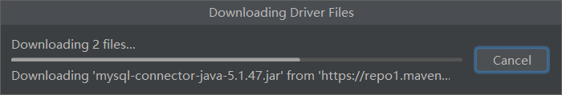

### 一、简介

[中文文档](http://mybatis.org/mybatis-3/index.html)

> 传统上Java与MySql的连接是用JDBC协议的。
> 它的弊端：①性能太低 ②sql有关代码写在了Java中，万一java文件中的sql语句需要修改就得重新打包编译。
> 解决方法：**Mybatis框架**。

ORM框架：Object Relational Mapping 对象关系映射  用于实现面向编程语言里不同类型系统的数据之间的转换。

**环境：**

- JDK1.8
- Mysql5.7
- maven 3.6.1
- IDEA

**在此之前需要掌握：**

- JDBC
- Mysql
- Java基础
- Maven（看Maven学习教程去吧、六个小时）
- Junit

#### 1.1什么是Mybatis

[百度百科](https://baike.baidu.com/item/MyBatis/2824918?fr=aladdin)

> MyBatis 本是[apache](https://baike.baidu.com/item/apache/6265)的一个**开源**项目[iBatis](https://baike.baidu.com/item/iBatis), 2010年这个项目由apache software foundation 迁移到了google code，并且改名为MyBatis 。2013年11月迁移到Github。
>
> **MyBatis 免除了几乎所有的 JDBC 代码以及设置参数和获取结果集的工作。**

MyBatis是一个Maven项目。

[到这里找它所需要的jar包](https://mvnrepository.com/search?q=mybatis)

- Maven仓库（后面的创建模块会用到）

```xml
<!-- https://mvnrepository.com/artifact/org.mybatis/mybatis -->
<dependency>
    <groupId>org.mybatis</groupId>
    <artifactId>mybatis</artifactId>
    <version>3.5.4</version>
</dependency>
```


- MyBatis 是一款优秀的**持久层框架**，它支持自定义 SQL、存储过程以及高级映射。

- MyBatis 避免了几乎所有的 JDBC 代码以及设置参数和获取结果集的工作。
- MyBatis 可以通过简单的 XML 或注解来配置和映射原始类型、接口和 Java POJO（Plain Old Java Objects，普通老式 Java 对象）为数据库中的记录。

#### 1.2持久化

**数据持久化**

 - 就是将程序的数据在持久状态和瞬时状态转化的过程。

 - 内存：断电即失——瞬时
 - 数据库(JDBC)，io文件——持久

**为什么需要持久化**

 - 有一些对象，不能让他丢掉
 - 内存太贵了，还容易丢失。

#### 1.3持久层

 - 层界限十分明显
 - 完成持久化工作的代码块

#### 1.4为什么需要Mybatis

- 方便
- 帮助程序员将数据存入到数据库中。
- 传统的JDBC代码太复杂了。简化，框架。

- 优点

  > 简单易学
  >
  > sql写在xml中，便于统一管理和优化
  >
  > 接触sql与程序代码的耦合
  >
  > sql和代码的分离
  >
  > 提供xml标签，支持编写动态sql
  >
  > **用的人也多**

  

### 二、第一个Mybatis程序


思路：搭建环境-->导入Mybatis-->编写代码-->测试！

> 这句话是回过头来说的：整个过程是把父工程的xml弄好，然后新建子模块，再设置子模块的mybatis-config.xml的环境，利用SqlSessionFactory类读取前面这个配置文件，生成一个对象，这个对象就是可以用来做配置xml文件中环境所作的的事情。

#### 2.1搭建环境

**搭建数据库**

```sql
CREATE DATABASE `mybatis`;
USE `mybatis`;
CREATE TABLE `user`(
	`id` INT(20) NOT NULL PRIMARY KEY,
	`name` VARCHAR(30) DEFAULT NULL,
	`pwd` VARCHAR(30) DEFAULT NULL
)ENGINE=INNODB DEFAULT CHARSET=utf8;
INSERT INTO `user`(`id`,`name`,`pwd`) VALUES
(1,'赵浩男','123456'),
(2,'麻新钰','123456'),
(3,'爱谁谁','123456')
```

**新建项目**

1.新建一个普通（不要骨架）的Maven项目
2.删除src目录，把他当作一个父工程，后面会在他下面新建子项目，这么做的**目的是直接控制全局的jar包依赖，不用在子模块中捣鼓**
3.在pom.xml中添加Maven依赖——去哪找这个依赖呢？[当然是Maven仓库中的mybatis了](https://mvnrepository.com/artifact/org.mybatis/mybatis)

```xml
<?xml version="1.0" encoding="UTF-8"?>
<project xmlns="http://maven.apache.org/POM/4.0.0"
         xmlns:xsi="http://www.w3.org/2001/XMLSchema-instance"
         xsi:schemaLocation="http://maven.apache.org/POM/4.0.0 http://maven.apache.org/xsd/maven-4.0.0.xsd">
    <modelVersion>4.0.0</modelVersion>
    <!--父工程描述-->
    <groupId>com.haonan</groupId>
    <artifactId>mybatisLearning</artifactId>
    <version>1.0-SNAPSHOT</version>
    <!--该目录下的子模块 下一步建立子模块后才会有下面这个标签对-->
    <modules>
        <module>mybatis01</module>
    </modules>
    <dependencies>
        <!--mysql驱动-->
        <dependency>
            <groupId>mysql</groupId>
            <artifactId>mysql-connector-java</artifactId>
            <version>5.1.4</version>
        </dependency>
        <!--mybatis依赖-->
        <dependency>
            <groupId>org.mybatis</groupId>
            <artifactId>mybatis</artifactId>
            <version>3.5.2</version>
        </dependency>
        <!--junit依赖-->
        <dependency>
            <groupId>junit</groupId>
            <artifactId>junit</artifactId>
            <version>4.12</version>
            <scope>test</scope>
        </dependency>
    </dependencies>

</project>
```

Enable import后Maven就能自动导入了。

#### 2.2创建一个模块

##### 2.2.1创建一个子module-Maven

> 项目上new一个module 选择Maven项目，这就是一个子模块了，命名为mybatis01。

这样做的优点是，我们之前在父工程那里已经修改了pom.xml配置文件了，不需要在子项目中再去重新导入依赖包了。使得jar包依赖可以统一管理。

```xml
<modules>
   <module>mybatis01</module>
</modules>
```

创建完成后，父工程中的pom.xml文件出现上面的modules标签。

子模块中的pom.xml中也会出现父工程的信息。

```xml
<parent>
    <artifactId>mybatisLearning</artifactId>
    <groupId>com.haonan</groupId>
    <version>1.0-SNAPSHOT</version>
</parent>
```

##### 2.2.2新建mybatis-config.xml

- **编写mybatis的核心配置的文件——从 XML 中构建 SqlSessionFactory**
- **mybatis工具类**

[看文档中对这部分的描述](https://mybatis.org/mybatis-3/zh/getting-started.html)

每个基于 MyBatis 的应用都是以一个 SqlSessionFactory 的实例为核心的。SqlSessionFactory 的实例可以通过 SqlSessionFactoryBuilder 获得。而 SqlSessionFactoryBuilder 则可以**从 XML 配置文件或一个预先配置的 Configuration 实例来构建出 SqlSessionFactory 实例**。

从 XML 文件中构建 SqlSessionFactory 的实例非常简单，建议使用类路径下的资源文件进行配置。 但也**可以使用任意的输入流（InputStream）实例**，比如用文件路径字符串或 file:// URL 构造的输入流。**MyBatis 包含一个名叫 Resources 的工具类**，它包含一些实用方法，使得从类路径或其它位置加载资源文件更加容易。（具体讲解在2.2.5中）

```java
String resource = "org/mybatis/example/mybatis-config.xml";
InputStream inputStream = Resources.getResourceAsStream(resource);
SqlSessionFactory sqlSessionFactory = new SqlSessionFactoryBuilder().build(inputStream);
```

**XML 配置文件中**包含了对 **MyBatis 系统的核心设置**，包括获取数据库连接实例的数据源（DataSource）以及决定事务作用域和控制方式的事务管理器（TransactionManager）。

> 将官网中的代码复制下来,这就相当于是个模板啊。以后还得接着用呢
>
> ```xml
> <?xml version="1.0" encoding="UTF-8" ?>
> <!DOCTYPE configuration
>   PUBLIC "-//mybatis.org//DTD Config 3.0//EN"
>   "http://mybatis.org/dtd/mybatis-3-config.dtd">
> <configuration>
>   <environments default="development">
>     <environment id="development">
>       <transactionManager type="JDBC"/>
>       <dataSource type="POOLED">
>         <property name="driver" value="${driver}"/>
>         <property name="url" value="${url}"/>
>         <property name="username" value="${username}"/>
>         <property name="password" value="${password}"/>
>       </dataSource>
>     </environment>
>   </environments>
>   <mappers>
>     <mapper resource="org/mybatis/example/BlogMapper.xml"/>
>   </mappers>
> </configuration>
> ```

复制到resource下新建的**mybatis-config.xml** 一般默认就写这个，不写这个的话到时候就把

```java
String resource = "org/mybatis/example/mybatis-config.xml";
```

中对应的字段改掉。

现在我们在resource中新建一个文件**mybatis-config.xml** 复制上面的内容到里面，略加修改。

> 先把mappers标签对删掉（对应上面的截图看）
> 数据库部分信息等链接上数据库（见2.2.3），复制url等然后去修改

```xml
<?xml version="1.0" encoding="UTF-8" ?>
<!DOCTYPE configuration
        PUBLIC "-//mybatis.org//DTD Config 3.0//EN"
        "http://mybatis.org/dtd/mybatis-3-config.dtd">
<!--configuration核心配置文件-->
<configuration>
    <!--环境-->
    <environments default="development">
        <environment id="development">
            <!--事务管理默认是使用JDBC的传输方式-->
            <transactionManager type="JDBC"/>
            <dataSource type="POOLED">
                <!--数据库相关的信息-->
                <property name="driver" value="com.mysql.jdbc.Driver"/>
                <property name="url" value="jdbc:mysql://localhost:3306/mybatis?useSSL=true&amp;
                userUnicode=true&amp;characterEncodeing=UTF-8"/>
                <!--useSSL 设置安全连接 在xml中&这个符号需要转义 后面加上amp才是真的&符号
                后面两个参数是为了输入中文不乱码用的-->
                <property name="username" value="root"/>
                <property name="password" value="XXX!"/>密码保密
            </dataSource>
        </environment>
    </environments>
</configuration>
```

然后跳过2.2.3继续配置

注：也可以不用XML构建SqlSessionFactory，这里就不展示了，具体的见[官方说明文档](https://mybatis.org/mybatis-3/zh/getting-started.html)

##### 2.2.3利用IDEA连接数据库

先**连接上数据库**吧，这样填写上面这个xml文件中数据库的url也方便。但是出现问题了，我花了一晚上去解决啊。

>  1.要用企业版的IDEA才能使用database功能
> 2.第一次连接数据库会没有驱动文件，得下载，但是下载得时候动不动就崩溃了。
> 原因：这个下载其实就是用工程用的Maven仓库中得jar文件，没有就去中央仓库找，为什么失败，因为我没有检查好Maven配置，用的还是默认的.m2下的setting.xml，换成我自己设置的目录下的setting'.xml文件后就好了，启用阿里云仓库下载飞快。
> 

下载了最新版的jdbc终于捣鼓好了，耗时一小时，然后有报错：Server returns invalid timezone. Go to 'Advanced' tab and set 'serverTimezon 网上说是时区错误，MySQL默认的时区是UTC时区，比北京时间晚`8`个小时。

- 所以要修改mysql的时长在mysql的命令模式下，输入：set global time_zone='+8:00';就好了
- 或者：在默认的安装路径下`C:----MySQLServer下`找到`my.ini`文件。修改在`[mysqld]`下方添加：**default-time-zone='+08:00'**。`（注意引号）`
- 我根据提示信息，在advance下找到了这个servertime原来是空着的，不过加上了UTC(网上一个教程的灵感，这是世界统一时间)

**终于成功了！！！！！！！！！！！！！！！！！！！！！！**

##### 2.2.4从SQLSessionFactory中获取SqlSession

> 续：mybatis-congig.xml已经完成，已经构建好SqlSessionFactory，接下来就是从其中获取SqlSession。
> 官方文档：既然有了 SqlSessionFactory，顾名思义，我们可以从中获得 SqlSession 的实例。SqlSession 提供了在数据库执行 SQL 命令所需的所有方法。你可以通过 SqlSession 实例来直接执行已映射的 SQL 语句。例如：
>
> ```java
> try (SqlSession session = sqlSessionFactory.openSession()) {
>   Blog blog = (Blog) session.selectOne("org.mybatis.example.BlogMapper.selectBlog", 101);
> }
> ```
>
> 诚然，这种方式能够正常工作，对使用旧版本 MyBatis 的用户来说也比较熟悉。但现在有了一种更简洁的方式——**使用和指定语句的参数和返回值相匹配的接口**（比如 BlogMapper.class），现在你的代码不仅更清晰，更加类型安全，还不用担心可能出错的字符串字面值以及强制类型转换。例如：
>
> ```java
> try (SqlSession session = sqlSessionFactory.openSession()) {
>   BlogMapper mapper = session.getMapper(BlogMapper.class);
>   Blog blog = mapper.selectBlog(101);
> }
> ```
>
> 这个代码是什么意思呢？稍后我们再讲。

##### 2.2.5编写mybatis工具类

> 用于创建sqlSession对象并返回，MybatisUtils.getSqlSession()

首先先看之前我们讲mybatis-config.xml时说的那三行代码：

```java
String resource = "org/mybatis/example/mybatis-config.xml";
InputStream inputStream = Resources.getResourceAsStream(resource);
SqlSessionFactory sqlSessionFactory = new SqlSessionFactoryBuilder().build(inputStream);
```

> 通过resource读取配置文件形成一个流，然后通过SqlSessionFactoryBuilder().build(inputStream)去加载构建这个工厂。
> 但是每次读取这个流进行构建sqlsession对象会很麻烦，所以我们就要去构建一个工具类。

1. 建包 java中建立com.haonan.dao com.haonan.utils 在其中utils时工具包
2. 再utils下建工具类MybatisUtils
   

其中写入代码如下（这时候就要用到上面的三行代码了）：最后生成一个sqlSessionFactory对象。

```java
package com.haonan.utils;
import org.apache.ibatis.io.Resources;
import org.apache.ibatis.session.SqlSession;
import org.apache.ibatis.session.SqlSessionFactory;
import org.apache.ibatis.session.SqlSessionFactoryBuilder;
import java.io.IOException;
import java.io.InputStream;
//sqlSessionFactory --> sqlSession
public class MybatisUtils {
    //接下来让他加载当前子模块下的mybatis-config文件,创建sqlSessionFactory使其生成sqlSession
    private static SqlSessionFactory sqlSessionFactory;
    static{
        //使用mybatis(提供SqlSessionFactory、SqlSessionFactoryBuilder类)获取sqlSession对象
        try {//根据Idea的提示这三句话不能直接写，得加try catch
            String resource="mybatis-config.xml";
            InputStream inputStream = Resources.getResourceAsStream(resource);
           	sqlSessionFactory = new SqlSessionFactoryBuilder().build(inputStream);
        } catch (IOException e) {
            e.printStackTrace();
        }
    }
    public static SqlSession getSqlSession(){//通过前面的sqlSessionFactory工厂生成sqlSession
        //SqlSession sqlSession=sqlSessionFactory.openSession();
        //return sqlSession;返回这个sqlSession对象
        return sqlSessionFactory.openSession();
    }
}
```

现在这个session就像是jdbc里面的statement对象一样,复习一下下面的代码。

```java
Class.forName("oracle.jdbc.driver.OracleDriver");
String static final DBURL="jdbc:oracle:thin:@localhost:1521:orcl";
String static final DBUSER="user";
String static final DBPASS="password";
Connection conn=null;
conn=DriverManager.getConnection(DBURL,DBUSER,DBPASS);
//数据库链接完成。
//Statement接口需要通过Connection接口进行实例化操作。
Statement stmt;
stmt=conn.createStatement();
```

现在一个连接了mybatis-config.xml中定义的数据库的对象sqlSession（当然那个xml中可以设置不止是数据库一个环境，这里是只有数据库的environment而已）已经可以通过工具类MybatisUtils调用它的static方法getSqlSession获得了。
下面就可以写代码了，来使用sqlSession。

#### 2.3编写代码（在mybatis01那一层哈）

##### 2.3.1实体类 建立User 看下面的包就知道是什么路径下建立的了

```java
package com.haonan.pojo;

public class User {
    //根据mybatis-config.xml中连接数据库的内容把实体类建立好
    //名字和数据库内容要一样
    private int id;
    private String name;
    private String pwd;

    public User() {
    }

    public User(int id, String name, String pwd) {
        this.id = id;
        this.name = name;
        this.pwd = pwd;
    }

    public int getId() {
        return id;
    }

    public void setId(int id) {
        this.id = id;
    }

    public String getName() {
        return name;
    }

    public void setName(String name) {
        this.name = name;
    }

    public String getPwd() {
        return pwd;
    }

    public void setPwd(String pwd) {
        this.pwd = pwd;
    }

    @Override
    public String toString() {
        //这就是为什么要名字一样的原因，快捷键alt+ins快速生成这些方法时下面这些变量就不用改了
        return "User{" +
                "id=" + id +
                ", name='" + name + '\'' +
                ", pwd='" + pwd + '\'' +
                '}';
    }
}

```

##### 2.3.2Dao接口（其实就是官方说的Mapper） 在dao下建立接口和UserMapper.xml配置文件

```java
package com.haonan.dao;
import com.haonan.pojo.User;
import java.util.List;
public interface UserDao {
    List<User> getUserList();//获得User
}
```

##### 2.3.3接口实现类  这个配置文件的作用就是相当于不用mybatis时，要用到的UserDaoImpl接口实现类一样。

看文档研究如何写UserMapper.xml

> 现在你可能很想知道 SqlSession 和 Mapper 到底具体执行了些什么操作，但 SQL 语句映射是个相当广泛的话题，可能会占去文档的大部分篇幅。 但为了让你能够了解个大概，这里会给出几个例子。
>
> 在上面提到的例子中，**一个语句既可以通过 XML 定义，也可以通过注解定义**。我们先看看 XML 定义语句的方式，事实上 MyBatis 提供的所有特性都可以利用基于 XML 的映射语言来实现，这使得 MyBatis 在过去的数年间得以流行。如果你用过旧版本的 MyBatis，你应该对这个概念比较熟悉。 但相比于之前的版本，新版本改进了许多 XML 的配置，后面我们会提到这些改进。这里给出一个基于 XML 映射语句的示例，它应该可以**满足上个示例中 SqlSession 的调用**。

先不写用注解实现，先学习用xml文件定义,将下面的官方代码复制到UserMapper.xml中。

> ```xml
> <?xml version="1.0" encoding="UTF-8" ?>
> <!DOCTYPE mapper
>   PUBLIC "-//mybatis.org//DTD Mapper 3.0//EN"
>   "http://mybatis.org/dtd/mybatis-3-mapper.dtd">
> <mapper namespace="org.mybatis.example.BlogMapper">
>   <select id="selectBlog" resultType="Blog">
>     select * from Blog where id = #{id}
>   </select>
> </mapper>
> ```

修改namespace,然后在其中定义需要的操作。


```xml
<?xml version="1.0" encoding="UTF-8" ?>
<!DOCTYPE mapper
        PUBLIC "-//mybatis.org//DTD Mapper 3.0//EN"
        "http://mybatis.org/dtd/mybatis-3-mapper.dtd">
<!--namespace *命名空间* 用于绑定一个对应的Dao(Mapper接口) 通过下一条语句的唯一定位-->
<mapper namespace="com.haonan.dao.UserDao"><!--后面会把他改成UserMapper-->
    <!--插入一个查询语句-->
    <select id="getUserList" resultType="com.haonan.pojo.User">
        /*返回一个UserList 类型是User类*/
        select * from mybatis.user
    </select>
</mapper>
```

注：namespace不要写错，返回类型不要写错，名字不要写错

#### 2.4测试代码

- junit测试

> 在test包下建立对应main中的层级结构com.haonan.dao.UserDaoTest

```java

public class UserMapperTest {
    @Test
    public void test(){
        //要去获取sqlSession，这样才能进行数据库操作
        SqlSession sqlSession = MybatisUtils.getSqlSession();
        //有两种方式执行，一种是获取Mapper 记住UserDao就相当于UserMapper 翻译过来就是用户映射
        sqlSession.getMapper(UserMapper.class);
    }
}
```

在sqlSession调用getMapper来获得UserDao接口的时越来越感觉有点不舒服：在老师用的这个例子中，把UserMapper写成了UserDao，本来是为了方便理解衔接上他以前讲的JavaWeb的知识但是我又没有上过他之前的课，并且越往后越发现这种命名并不好，所以我又都改回来了，神奇的是我把dao下面的UserDao接口一改，对应的UserDaoTest的名字和绑定UserDao的UserMapper.xml中的namespace也自动都改了，很方便啊Idea太强了（不是rename而是refactor）！

这时候再来理解getMapper就简单了，最起码从语言的定义上有了亲近感。

怎么获取的Mapper呢？就是通过UserMapper这个接口的class对象。

```java
UserMapper userMapper = sqlSession.getMapper(UserMapper.class);
List<User> userList = userMapper.getUserList();
```

我们获取这个Mapper就是为了是使用这个接口类中的方法。可是我们回过头来想就算获取了这个UserMapper又能干啥，UserMapper的代码很简单啊。

```java
package com.haonan.dao;
import com.haonan.pojo.User;
import java.util.List;
public interface UserMapper {
    List<User> getUserList();
}
```

**对的，所以这里就体现出了为啥UserMapper.xml叫做UserMapper接口的实现类的概念。**因为我们正是在UserMapper.xml中实现了一些功能啊。

```xml
<?xml version="1.0" encoding="UTF-8" ?>
<!DOCTYPE mapper
        PUBLIC "-//mybatis.org//DTD Mapper 3.0//EN"
        "http://mybatis.org/dtd/mybatis-3-mapper.dtd">
<mapper namespace="com.haonan.dao.UserMapper">
    <!--插入一个查询语句-->
    <select id="getUserList" resultType="com.haonan.pojo.User">
        <!-- 具体解释看第三节 -->
        /*返回一个UserList 类型是User类*/
        select * from mybatis.user
    </select>
</mapper>
```

那个叫getUserList的id就是对应接口里的getUserList方法啊。这其实就是相当于用xml重写了接口的方法嘛。

所以说获得的这个userMapper中的方法其实并没有那么简单。下面是完整的测试代码只是第一种方式，通过获取Mapper的方式实现的。

```java
package com.haonan.dao;
import com.haonan.pojo.User;
import com.haonan.utils.MybatisUtils;
import org.apache.ibatis.session.SqlSession;
import org.junit.Test;
import java.util.List;
public class UserMapperTest {
    @Test
    public void test(){
        SqlSession sqlSession = MybatisUtils.getSqlSession();
        //Mapper 记住UserDao就相当于UserMapper 翻译过来就是用户映射
        UserMapper userMapper = sqlSession.getMapper(UserMapper.class);
        List<User> userList = userMapper.getUserList();
        for (User user : userList) {
            System.out.println(user.toString());
        }
        sqlSession.close();
    }
}
```

#### 2.5几个错误分析：

1. ****java.lang.NullPointerException**
   	**at com.haonan.utils.MybatisUtils.getSqlSession(MybatisUtils.java:25)**
      	at com.haonan.dao.UserMapperTest.test(UserMapperTest.java:14)**

下面是几种原因

> 1、字符串变量未初始化
> 2、接口类型的对象没有用具体的类初始化，比如：
> Map map // 会报错
> Map map = new Map(); //则不会报错了
> 3、当一个对象的值为空时，你没有判断为空的情况。
> 4、字符串与文字的比较，文字可以是一个字符串或Enum的元素，如下会出现异常
> String str = null;
> if（str.equals（“Test”））{
> //这里的代码将不会被触发，因为会抛出java.lang.NullPointerException异常。
> }
> 5、优先使用String.valueOf（）方法代替toString（）
> 当程序代码需要对象的字符串表示形式时，请避免使用该对象的toString方法。如果你的对象的引用等于null，NullPointerException则会抛出，使用静态String.valueOf方法，该方法不会抛出任何异常并打印"null"
> 6、class被声明了类型， 默认 class = null; 这样在调用class中方法的时候系统只能给你个空指针异常， 给其实例化就好了：class = new Class();
> 7、返回null，方法的返回值不要定义成为一般的类型，而是用数组。这样如果想要返回null的时候就能避免许多不必要的NullPointerException

看样子是返回了一个NULL了。

```java
private static SqlSessionFactory sqlSessionFactory;
    static{
            SqlSessionFactory sqlSessionFactory = new SqlSessionFactoryBuilder().build(inputStream);
    public static SqlSession getSqlSession(){
        return sqlSessionFactory.openSession();
    }
//这就是出错代码的地方2.2.4中的代码精简了一下，发现问题了，当时第三行重新SqlSessionFactory 了一个对象。作用域导致返回null。是自己失误了，2.2.4中已经把代码改回来了。
```

**2.org.apache.ibatis.binding.BindingException: Type interface com.haonan.dao.UserMapper is not known to the MapperRegistry.**

报错位置是：test测试类

```java
UserMapper userMapper = sqlSession.getMapper(UserMapper.class);
```

UserMapper说是没注册MapperRegistry。为啥会这样呢？

##### 整个过程的梳理

我们来重新梳理一遍这个模块实现的整个过程，我们好像遗漏了什么。
	首先我们是将一个数据库连接封装到了一个mybatis-config.xml中，希望它产生一个类似于jdbc中一个statement的东西——sqlSession，为了产生它我们将用于生成SqlSession的一些语句放在了一个类中写成工具类中方便以后使用。
	之后我们又开始着手开发实现类的编写。
	我们写了User实体类对应数据库中的内容并在里面写了构造方法和toString打印方法。再然后写了一个UserMapper接口希望它承接一些数据库的操作，但是这些操作并不是写在接口里而是放在它的实现类中，随即我们写了UserMapper.xml通过namespace绑定在UserMapper接口上作为它的实现类来实现它返回一个UserList的功能。
然后我们开始写测试类，我们想要先获得一个SqlSession对象，来完成数据库的一些操作，而这些操作正好放在UserMapper.xml中。这时候停下来想想，在此之前用于产生SQLSession的mybatis-config.xml和Mybatis工具类并没有与UserMapper接口和UserMapper有什么交集。他们俩是怎么建立联系的呢？就在下一步-->然后sqlSession实例很奇妙的用getMapper获得了这个操作。这时候又要想，咋你凭啥想要我的Mapper我就给你啊？之前咱俩不是没啥关系么？对！！！没有关系，所以在这行代码这里报错了。报错信息就是就是说this Mapper is not Registed in the sqlSession。
那我们就可以想如何把这个UserMapper和这个SqlSession联系起来呢？找他爹呀，就是mybatis-config.xml。具体怎么做呢？这就要回溯到我们建立mybatis-config.xml时的地方了。拿我们写的与官网的例子一比，发现这个文件中少了个mapper标签对。

```xml
<mappers>
    <mapper resource="org/mybatis/example/BlogMapper.xml"/>
  </mappers>
```

当时为啥不写？因为当时还没有这个UserMapper呢，谁也不能未卜先知不是所以当时老师不写。所以添加缺少的在这里为注册的Mapper就行。

```xml
<mappers>
        <mapper resource="com/haonan/dao/UserMapper.xml"/>
</mappers>
```


这正好也帮我们理解了原来getMapper是这个意思啊，获取已经注册的Mapper。

3.### Error querying database.  Cause: com.mysql.jdbc.exceptions.jdbc4.CommunicationsException: Communications link failure
连不上本地数据？？？
时区serverTimeZone没设置好。

```xml
<dataSource type="POOLED">
    <!--数据库相关的信息-->
    <property name="driver" value="com.mysql.jdbc.Driver"/><!--事务管理-->
    <property name="url" value="jdbc:mysql://localhost:3306/mybatis?
    serverTimeZone=Asia/Shanghai&amp;//把这个改了它。
    useSSL=true&amp;
    useUnicode=true&amp;
    characterEncoding=UTF-8"/>
    <!--useSSL 设置安全连接 在xml中&这个符号需要转义 后面加上amp才是真的&符号
    后面两个参数是为了输入中文不乱码用的-->
    <property name="username" value="root"/>
    <property name="password" value="Zhaohaonan1234!"/>
</dataSource>
```

4.当我想用maven的clean清楚target文件时，报了下面这个错：

Invalid packaging for parent POM com.haonan:mybatisLearning:1.0-SNAPSHOT (E:\IJ_work\mybatisLearning\pom.xml), must be "pom" but is "jar" @ com.haonan:mybatisLearning:1.0-SNAPSHOT, E:\IJ_work\mybatisLearning\pom.xml

没有有效的打包方式，在父工程下的pom中加入packaging标签，设置为pom。

```xml
<packaging>pom</packaging>
```

然后成功了。

5.还有可能出现的其他错误——资源过滤问题——找不到UserMapper.xml（虽然我没有遇见）
查看resource生成目录中有没有这个东西。弹幕里说是什么工程架构和部署架构不一致的问题，说啥只要放进resource里面就好了，我也没有放进resource中啊。


我的有这个文件，但是我在第四步clean了target以后，并且加上了那行代码以后再运行就特么崩了报错了？报的就是这个错，这也太神奇了吧！？并且target下的


UserMapper.xml没了

**maven由于他的约定大于配置，比如Java里面只能写Java，在它里面写xml是导不出的。**
现在在回过头来看弹幕说的那句话，把文件放进resource中就行了，但是我把UserMapper.xml放进那里面了也没有用。可能是过于粗暴不好使。
那就用老师教的方法吧。在pom.xml中加上build操作。并且建议大家，每新建一个maven项目，就把该设置导入pom.xml文件中，以防不测！！！

```xml
<!--在build中配置resource，来防止我们资源导出失败的的问题-->
<build>
    <resources>
        <resource>
            <directory>src/main/resources</directory>
            <includes>
                <include>**/*.properties</include>
                <include>**/*.xml</include>
            </includes>
            <filtering>true</filtering>
        </resource>
        <resource>
            <directory>src/main/java</directory>
            <includes>
                <!--让Java路径下可以包含下面这俩个文件-->
                <include>**/*.properties</include>
                <include>**/*.xml</include>
            </includes>
            <filtering>true</filtering>
        </resource>
    </resources>
</build>
```

不行啊  还是不好使，当是excludes的时候甚至它把java文件整成resource了，我又mark as成Java文档形式再把这几行代码删了以后才又好使了（并且删除了前面那行packaging pom 要不然运行不起来啊）先不管了  先学习第二种方法吧，等等，先贴一下第一种方法的完整代码，前面没有写

```java
package com.haonan.dao;

import com.haonan.pojo.User;
import com.haonan.utils.MybatisUtils;
import org.apache.ibatis.session.SqlSession;
import org.junit.Test;
import java.util.List;
public class UserMapperTest {
    @Test
    public void test(){
        //要去获取sqlSession，这样才能进行数据库操作
        SqlSession sqlSession = MybatisUtils.getSqlSession();
        //有两种方式执行，一种是获取Mapper 记住UserDao就相当于UserMapper 翻译过来就是用户映射
        UserMapper userMapper = sqlSession.getMapper(UserMapper.class);
        List<User> userList = userMapper.getUserList();
        for (User user : userList) {
            System.out.println(user.toString());
        }
        //关闭sqlSession
        sqlSession.close();//不关会浪费内存
    }
}
```


第二种方法不太常用,也不建议用。

三个接口的分析


所以修改test代码

```java
package com.haonan.dao;

import com.haonan.pojo.User;
import com.haonan.utils.MybatisUtils;
import org.apache.ibatis.session.SqlSession;
import org.junit.Test;

import java.util.List;

public class UserMapperTest {
    @Test
    public void test(){
        //要去获取sqlSession，这样才能进行数据库操作
        SqlSession sqlSession = MybatisUtils.getSqlSession();
        try {
            //有两种方式执行，一种是获取Mapper 记住UserDao就相当于UserMapper 翻译过来就是用户映射
            UserMapper userMapper = sqlSession.getMapper(UserMapper.class);
            List<User> userList = userMapper.getUserList();
            for (User user : userList) {
                System.out.println(user.toString());
            }
        } finally {
            //关闭sqlSession
            sqlSession.close();//不关会浪费内存
        }
    }
}
```

### 三、CRUD增删改查

#### 3.1select选择查询

```xml
<mapper namespace="com.haonan.dao.UserMapper">
    <!--插入一个查询语句-->
    <select id="getUserList" resultType="com.haonan.pojo.User">
        /*返回一个UserList 类型是User类*/
        select * from mybatis.user
    </select>
</mapper>
```

- id: 就是对应namespace中的方法名字
- resultType：Sql语句执行的返回值
- parameter：参数类型

现在我们去UserMapper接口中去新加一个方法。

```java
//根据ID查询用户
    User getUserById(int id);
```

并在UserMapper.xml中新建一个namespace来实现它

```xml
<!-- 实现方法getUserById根据Id查询 -->
<select id="getUserById" parameterType="int" resultType="com.haonan.pojp.User">
    select * from mybatis.user where id = #{id}
</select>
```

测试类新加对该功能的测试

```java
@Test
    public void getUserById(){
        SqlSession sqlSession = MybatisUtils.getSqlSession();
        try {
            UserMapper userMapper = sqlSession.getMapper(UserMapper.class);
            User uer = userMapper.getUserById(2);
            System.out.println(uer.toString());
            sqlSession.close();//不关会浪费内存
        } finally {
            sqlSession.close();
        }
    }
```

```sql
User{id=2, name='麻新钰', pwd='123456'}
```

成功打印。（千万不要把mapper里面的namespace，id，参数，和返回类型写错，一个字母错了，就不会运行通过。）


